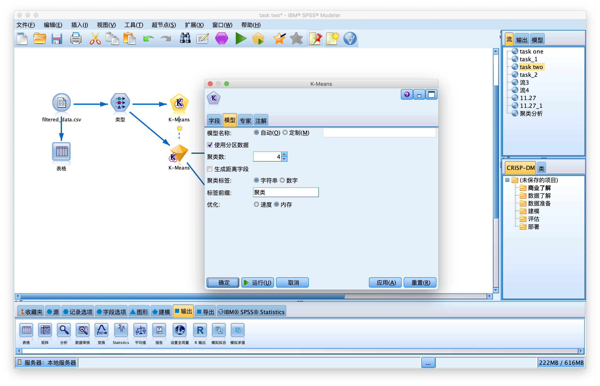
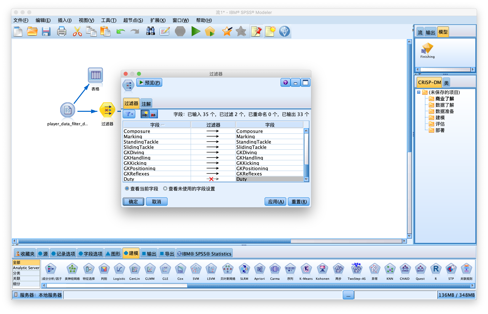
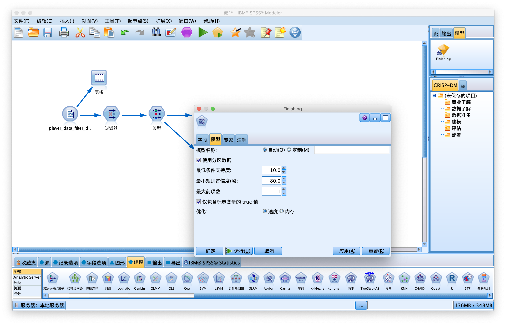

# 数据仓库与数据挖掘 期末作业报告

## （一） 分析数据集概述  

### 背景

足球，英文football，被誉为“世界第一运动”，全球体育界最具影响力的体育运动。

《FIFA19》是由[EA](https://baike.baidu.com/item/EA/30396)公司开发的足球游戏，是广大足球爱好者的福音。

游戏强调与现实世界的一致性，根据球员在现实中的表现，为每个游戏中的球员设定了33种不同的能力值（如：速度，侵略性等）。玩家可以根据自己喜欢你的球星搭建自己的球队进行比赛。

![](data:image/jpeg;base64,/9j/4AAQSkZJRgABAQEASABIAAD/2wBDAAgGBgcGBQgHBwcJCQgKDBQNDAsLDBkSEw8UHRofHh0aHBwgJC4nICIsIxwcKDcpLDAxNDQ0Hyc5PTgyPC4zNDL/2wBDAQkJCQwLDBgNDRgyIRwhMjIyMjIyMjIyMjIyMjIyMjIyMjIyMjIyMjIyMjIyMjIyMjIyMjIyMjIyMjIyMjIyMjL/wAARCAEsAgYDASIAAhEBAxEB/8QAHAAAAQQDAQAAAAAAAAAAAAAAAAQFBgcBAgMI/8QAVhAAAQMDAgQDBAcEBAcOBAcAAQIDBAAFEQYhEjFBUQcTYRQicYEjMkKRobHRFTNSwWJy4fAIFiRDU7LxGCUmNDU2VFVjc3SCkpMXN3XSJ0VGZJSis//EABsBAQADAQEBAQAAAAAAAAAAAAACAwQBBQYH/8QAMhEAAgIBBAEEAQMDAgcBAAAAAAECAxEEEiExBRMiQVFhIzKBcZGxBhQVM0JDUqHB8P/aAAwDAQACEQMRAD8AvaiiigCiiigCiiigCtazmtVLSClKlJBVyBPOgM0da1worCgcJAIIx12x8K2oDaiiigCisZrm68psJ4W1L4lAHhGcZ6n0oDrRWBjG1ZoAooooAooooAooo5UACtSelZzvyqFeIPiBE0Tb0K4EPzX0ktMleNh1PXFdSywTFx5tsfSLSgf0jik/7Vt4f8j22P5u3u+YM15huXiFfNXyZMic8piDHT5imIvujh5AE8zvTSb1FDfC6ysOqRsY6iODPU52JHau4SeGMM9cJlxlOqaS8grTjIChsT3rvnIrxvB1BMt9w9qiT5TLqk4V5hJS56Kz93yqwNI+LGoISIzEsMy4yVAFtZ4XSg9QrPTpmmE+mMM9EjlQTTZZb3EvsD2uGVABRQttxPCttQ5gjof9tOXpXMD4OT8hmM35jziUJyACTzJ5CtnFoQ2XFqCUAZKicACmqUyxFlv3a5y0lhgZZSrZLIxufVROd/gBVTau1nP1PxsRUri2Pj8tbnIr/rY3+AFWRr3f0LqNPO5+1DpqjxGXdXJMGwyfZLZHOJt2KdvVDXcnfH9zTbYpFx1i03Y9PMuWuytnMiVklx3fmpXVR7fea76X8L13yDHfva1x7ayvijQGvd40fxr68Sjj1xtVp25VmtTTltgezMIiJBcZbOPLB5cXYnHXetUrK647a1lmSyp7mpPo3stmhaftiIUJsNtIGSScqWepUepP4cqgmrtZPW0SHLyPY7WVFEeG2f8AKZmDzJ+yj8xS3XXiNHsCVW+3BuVcFD3gTlDI6cXc+n315+1Jcp94uap9wkLfdX/FyHoByFW6TRTte+fRXO6Ke1D3ftRzNRym5EkhDKE8LDDeyGk9gPzppOOtJILvGyUHmj8qWY2r6KuEYR2x6PNmpOf5G3hWzOSlHvFSsBPU5qydMxPYpiEW9lqVcs4ekqBLUUcuFOPrL6ZFRFu1Cf5bQZU4+s4QEDKiewqy7UGtD21q1WtpVy1NI+yDxJjk/hkV5Gq1sJpxjk927xF1MYzfJadmtSLdH41FTkl0AuOLAyew7ADsPx507dBSWD53sMf2j9/5afM3z72N+W1Kq8GWckEFFFFcOhRRRQBRRRQBRRRQBRRRQBRRRQBRRRQBRRRQBRRRQBRRRQBRRRQBRRRQBRRRQBRRRQBQaKOtAa0xaqjPrtYmxQTKhL89oD7WOafmM0/cO9arQFJKVDIPMd66mTg9skxts9xRd4EW4MODyXG8lONwfj0xvt6058jvzzUZ0zaZVhn3WMR/vatwPxVE/V4slSfTBGfnUkbWh1pLjauJChkKHUUfZ21JSe3o6UUUVwrNTzrGNqyedH4igZkc6M1iigNs0VrR60BtRWtbUBjNYJo2rNAcpD7caO4+6oJbbSVqJ6AbmvH+s9QK1RqibcQSGlqIbzueEHbPrV++NV9cs+hHGWVlLs5wMAg78PNX4CvNTDZRjiBIwMkGrocRyyIhbLylkJyAo7gcjS0NEOFSpQ4iniBOQc55D4/yqV2PQq76wp4T0Rgk+4nhzxepPSnab4ZXgMNqjll5Te4KVYKvX+yszth8s1Rom1lIZGUw5NpWnyUrdbSWWgkElZ3JJz1yaaLfFitSnYMpHlTCMJUteUZ22PUdsg04TNOXiAS3Lt6t1cQCCUnJ6j8aauArcaLcAEIPvBw5zjoflmurD6Zx5XaLS07q9y0Fj2cpWiSQHgtW4cBwF/HpjsKuefqe2WqLFXLmNlcgAN8J/eEj8s/KvJsV6VFAK1No8vJbCj76M9KtjRtonXx5hyITIDKA27dH0HyWgB9VhJ+uR3O2asXXIqrrcszeB7vFrv8Aq+6q/aDKm4zB42beHNj0BWeQz/sxUoseioluYbk3VDLshsFSGwPomB14UnYnuo7mnkvW/TFtQ28+UpAJ43FZUrG6lKJ+8k7CoRdtWw9RxVyzM8jSzWfMkJJQp9wHHBg74Nd3Po0q+c16ceEjrqvUN0usGQmwzW7XaI3/ABq7OEpCv6LX6j4Cqov3iFJnTG49qW5DtzK+MbkrkL5eY4TklR5jOcU56l1MdRlMZoJatbQ4WIyNhgbAnuah8myNqyphRQex5f2V6GjnQpfqFlvgtROvfW8/g6LcU8tTi1KUpR4ipRyST1zSeU2XWFAAZG4royy8y0EPJwR17itjg19HXOEo+1nyltFunm1NNMaYjvlSAemfzqR2m1yrxcG4cRlTrqugHIdz2FRuUz5LqjnAO4q5dIsOXqzRrVpxl2LGKB7fcnWwlxw9Ug9qx63UelXhfJv0dHqXRs+EdI0M29xNj02hEq8ODEqeE7MDqEnpVi6W0hE07HKlEyJzo+mkL+sfQZ3ApfYdPwNPwhHhNBJO61ndSz3Jp2AFfMTnl8Hr6nWOz2wfH+THKt6xjNZqBgCiiigCiiigCiiigCiiigCiiigCiiigCiiigCiiigCiiigCiiigCiiigCiiigCiiigCiiigCiig0Bji3rBrH61jjRnHEMjmOtOTqWTbbfPI1ohKWknKsDOwJG3oKw+15zDjZ4glaSk4OD8u1NWnlSl25USehRfiuFpS1DZwDHCsfEY+dF0dSzHI9A1muQcQpxTYJ4k4J+B5V05UImDWiGkNlZSMcauJW53NZcWltCnFnCUjiJ9BXKHMYnxGpUZwLZdTxIUOoruDuODoQsrSQocI5p4eZ6HNYQ+044422tClt/WSDunatycJJqD6Hle2XDUctscbrks/WO2BsP50SLYVboSn9EwkTG4tudmvBSENNqcUFcwEgn+RqL+HOqJ2rbFJuU1ttA9rcbZCBjCBjAPcjPOpFeWFSLLLYQkqU40UAYzudv55rnp+yx7BZY9ujICUNJ3wMcSjuT9+a7xtI+3Z+RzozRSK7XFi02uROkLCG2U5JPft8TtUSCW5qKEs6+Nx7zEtbKPNkvnKgD+7R1Uad899qiulLTICn75cRifO34T/AJtH2U1w8Sr1Os2l0m3L8qRJfSwHv9GCCSfQ4GKm/pFtqhGSjErzx6k+ddLNAyeBCFukDlknFVgxGKvcCcp+1wpztUi1GZ19abuEuYX3IzYbHEQo8Oc4z+tYtzHlwG1gAKVkkGo2P2pIjXDD5JDplC48ZnibKUEYO3KrChSmlpSCocRPKqoh36fHaWlm1uymeL64/l3qVaf1jYZ5bYec9mkg4Lboxv2rz7am+T1abIpbSwnYkSewkOoChjGeo+FRe5eHmm5r5dVGU0oniJZcI3qTNJZ8oLZeBQeW9aOsOcPGkjH4VU5SisIl6cG8sq3VXhxbYtokyoTzyHkAr+lIWCBvjPMVamnr3Ctvh7aZ0x1LTaYiM9ycdPjUI1pMdas8xoEZLeNue/pUE86Q5b47Ljzi0MoAbQpWydulehpdzrzPsu0vilrbcJ4iuxfrbVE/WF6bTI42rC2reMyeFx5AOfePqRy5CoZeLtd5N0VJZj+yRUJ8pmG3lTTbeMcODsc9T1NLX7q3FdKJDa0EdcZFZbukJ3HC+kH1OKt4fya5+J0EntjZhkbdy4S7EC47g+uwTt/5T1+Fc2r5OZ280kdlb1L/AC2HwSUtr9cA0mfs0J8nLQSeWU7UwyP/AAfUw509uRnZ1Qrk8wlX9XaliLtb5P2lNE965PaXQVfQukEnYEVZnhz4LqXIbu+pUgx0kKZh/wCk7FXYelW1321/tZ5+seqq9uqSa/8AYl0d4YOatKJ055yNbUkcKkJ95/uE55D1q+7bbYdpgNQ4LCGGGk4QhHIf2+tKG2m2GktNIShtAASlIwAPh0rfkK7fqLLn7meJhJ+xYQUAjHL8KYzqJMy5i32lkzFNqAkSR+4YHUcX2lf0R86JmqrcxcFWyO77bdE84bB4lj+t0T86pySSz0PuazXNKiUJKhwkjOK6dK4cCiiigCiiigCiiigCiiigCiiigCiiigCiiigCiiigCiiigCiiigCiiigCiiigME9KBzqPnUqIMkR70wqConCJH1mHD6K6HlsrFPqXEKSFJWkpI5gjFOuwuTpRWnmoH20/fWwII2OfhXMncGjzqGWlOuL4UIHEonoK1YkMyWkusOJcbUMpWk7GuisEEEZpqmWp0AvWt8RX05ISBltX9ZP8xUsZOxSfDHXHyqAak0zeo1+/b2n31KeUoKeiqcIDmPwx6GnyJqN9iWmFeoaobyjwNvJ95lw+iuh9DipHnO9FlF0JSol1kQWm4ftGEhxbS2XkgB1lwYUhXY/33pNJlOQtSRW1LWqNMQUAHklxO4x8Rn5incJAOUgAnmetcpEduQhPmNBwtqC0Z6KHIinyVqS3N47I5rmXMtdpausN9aPZH0rdQPquIJwoKHwNSOK+iVFafbOULSFA+mKTXOI3d7LIiuJITIZKcHpkfrTHpWXKOkzFDJE6BxRyhR5qQNj89ql2i1RU6kl2mSlSQtBSrdJ2NJbVbWbRbWYEcrU0yCE8ZySMk/zqL6BuGoZzc39ttugIcw2pxHCc9QB2FS2LKblR0PtZ4D3GMEHGD8CKjjHBXZCVctmcm7xJYXw8+E4qIeGsMsWOU+4khb8t1SgobjCsY/CnvT096fb3ZEhwKIkOJBxySFYH5VppR9EmwofRj33nVEDuVmurKWCzc4VSh94Hz4VHbvq6NbLvGtTTK5M15QHlNn6qT1JPzNPbz3CQlJGabFw4AuCZ62mhLWA2l1WOI9gPx+VcS+SFW1PM0ObjiFp8sPcC1pJBSdx3IphkstakuzTSyly2QHOJaTyekDkD6I5nuSO1OykIJ4lJTxYI4uuKRYg2CzrLYSxEZSVEk99znPXNdSOQW7rtmNTaptmk7WZtxdIB2Q0gZW4ewFM+sG3NT+HKpLDDjbi20SUNrHvJ69PQ1Gbbp2VrrVCNSXvj/ZjH/FYi+SgDtt2zgnuas2ZcYcFkl9xAHII2yr0xXWsMnbX6b29s81IgtxratghSXSUpX2WSeY+VKmGXpJEeMjjUNgmnvVSIn7ekiOwhkAgqQlXFwqO5Hp8KaIsowZCJCVAEHlVVscLJKqWXhnOfpnUakea4t6JGIxlrkk9OLG+Omaj0/TktlDKfMdlP83CEkoz/AEVYyKua36mEttsoQDsAds0pud2jxIxHCnzFpxsMVjjqGnho3PTJ+5MiOlkXe2aXkTZT6jHjpKk8ZJISB17iobN8QNR32SYsBbyEYK/LYRlRAG578t6ui0oEjTiw+gFLq921DbHamZWm22Zzj0IsRuMFGzQ+qeg69ajGyEZNy+RKucl7fgrqJiTBFyN2enCSPLfaeGC2Ruk/Ktxtt0p4vlmiWDyoUNJCVnzF56nGM/fTOa9ODzFYPsvAaX0tPufbOEuGzMZLbyApPQ9RUSuGm5LDhVGy4j0qaYoru1M0eQ8RRrOZcP7K4KZ0bb6RPwpVGu9zDiGkKW4pRwlBGSTU3dYQsYKU49Rmp/4baOtSUq1FcWGOJnJZ4tggDms/OobGuj5bX+Mu8fH1I2MefD7w99hhR7pfENuT1jjQzj3GRjbnzV+VWVtwjbbGwqOSdbWSLbTOXIIZKilGUkF3HVA6jpmqi1ZrTUur5Rg22U3aLVnLi/M4VFPdSv5Cjz8nizq1ep/Ukmy539VWaM66z7Yhxxoe8lv3jnkE7c1elMVxnuXh4RJ5kMsODItsU/TvD/tFD6ie42z1NV7oOxy3wWNNwn2BnEnUFwG4z9YMN8t8Y4uferdgWJFitTjdrbD05Qz50tZ4nl91q59+VMozJximmuRyt8dEWA0y3FajNoThLLeMIHasRrdBiSH3o0Vhp59XG6ttACnCepPM1FrprZZv7WmrLF9uuxSPaVoP0MQHmVn07VIbPaE2tt0rkOyZLyuJ55w7qPLlyA9BTBDCxnI5gVtWvrW1cIBRRRQBRRRQBRRRQBRRRQBRRRQBRRRQBRRRQBRRRQBRRRQBRRRQBRRRQBRRRQFTSbiVqIfKlcQ3RjNcGrm2FpaQXEY24c7YHpUTka5tMsJRIdSojICwnBHbPcetNI1G+3KKokYuZ5HNYnGeMM9ZuHaRb0V8eXxl9aMge6U5wKlWnG1vMqkuLKkklKBjGR1JqjIes56VcLsF0KHJWNquXTV4LulLc+QAVt5V6HJq2iuUpGXV2RUOCVlCDzAoLSccz99NKrqEse8dyoJHzxTg5Mbbwkqwc43rW4OJgU0+jdTCVcwCOxFHlq/o7Vs48EJ4ue2cd+1ClnIxyxkmok8iNK5vtCULjN+WcgrS7yPwxypWppRB3G9aoJACSTxK95R7VxbuCFOrRkYQcbGuqLfRFyXZpCalNxuCUsOugkcYHMZ2PxqOTnnbDqxEryXVQp6A295aCoJcHJRA7japel1Csb89+dauqSMbZUTgD1p0Wwtw238mg6Y2/Om9y5NOw5whlLj0XiSpvlheM4p2IRw7gbDJPam6NBgpVLcjnBmHzFnPM44ciuJ/YjKKeWR7RkpTmikyHE8Kz5ilfHJJrfw+czouI6STkrVv/WJpwtNobhWH2KOtTjJ4xlWy9yc/OtNL2Fyy6eRbfPDgbcXwr4ce6VZGR3qTL7LISjLHyxt1Dp5q8TYdxXPfiqhq4leWrAUnOSD25c6SWCW7qS8O3hbYTAjFTMLiG6yfrOfhgU+XfTcq6WyTCFxU0mQsZUE/URtlI+OPxrvDtarUiNDjeWIaEpbSgDCkbc/XNdzwFbFVYzljZdGpt0ubduDJatiUhch4nHmno2PTuaRpRJ1Fdn2LjGVHtkNwBtpzYyFjqr+iO1TD2EOJUlajg7e4cbVENT6IjqjLlxZcpt1OPoy4pQVv0ya7Da+GV+u1HhC+96hh2GKUjhU8E8SWgccI7nsP7iqylXK73FyTdFkstob3kqGFIQN+Fsckk5wOoz3rOoGIWmrsty6S0O8WCgeb5iykbJ275zThqBvi0RILY+t5alHuOIZrXGqKjuychrVBOO3LfyQZpXnJLnJRPER2zSOSvj+jztnbFdPPDDyARhKhg46Vopol73u9ebfLJZVHA96ZWqNMSFLPAeeTS/W17S1PjNR46nlMAKWkEAEnfHyH51HTMVb3EupPCeRz+dcpGptPSZIduTcl57biDJ4QfQk1iUMyyb1ZiOCxLVru2To6IbTb4lKKU+QhsqPER6bYrpfru1bWR5jnCsnhGN8016f1PplthUayrLale+WnG8KPccXU0yX+SJc7Ks4CiUJ9PSuKn1LOTTS3OUYL5Es6c5cJRkLJ5cKQegpPWNxsaK9VLasI/QdPWqq1BGaxXNTwbUEqGx610BzuDXSxWRbwbIQpxQQhJUpRwAKfJl6cZtjUJstuOsj6NoZ8hCh9pY/zh+Ow7GmHfocUYxt2rqeOTFrdFDVcWdDBMu92VMW5PcL7pO6l9vT07AVMNOMW+LFTdtSNrQ2ogRISPeckq9E8+H1os1jl3qekRYbby0HIddTlDZ6KPr6VNbbabTpmU67GAvF9Ay5Lkq+jj59enwG/bFabLK5RSxyfEa+Gq0djppszFkut1xlMWtq43RLFphJT9HFJGQDy4j37JA+NMk3Vl0vl6RZ7dDmx4jmPNlIHC4EHqM/VB7neu8PTs++TET7lIWrG4dcRgp9GkH6g/pHKu2KmkSDGgMhqO3wjmSTlSj3JO5PrWOWF0eJG1Rbco5YmtNjtlhjLbt8RtgK95xQ3W4eqlKO6j1ya6QLvAuhdEKW2/wCUcKCFZ4T60tWgLQUncEYI70y2PSlr0+/JegNKQuQcryokc84H31BYwQiobXl8j50rNYxis1wrCiiigCiiigCiiigCiiigCiiigCiiigCiiigCiiigCiiigCiiigCiiigCiiigPCiJLrBIKQeWyhTizfnU4yopO3LvSzy7dcE+4oNL/hXuPv6fCkEuyOsDiAPD0PMH4Gt9mikluhyiScksjy1qZ8o94kp6nFWNpLWjStPoiKc4FMLUNzjYnI/nVI8L8VWMKT+VLYt3ciklIGeZGMg/EVClQhL3cMqulZOOEX//AI1skpJfBSDnZWacr9q1KJbJYeRwuNBwb5O4wap+xaq0w+UMXu0BlXL2hhasfNOam8vSFm1FbUPWGcnCU+6PMKhjseo+dTcozfB5Vmp/28sWxwvssZOrWHbmiO2tC08LY58lEfy3/CpAxdWH0AhYKVr4Rv2qmYekLza2G5LctuQ+jJW19+MHvT7arm75CW1lSHELPEk8wonrUXUpLgsp11dj9kslq+ckcS8jKs8PbAqIynXorDauI8bjudunpWZN2Cbm0ylY8tpAbX2JIyaahclyGg4/gpZyv4mo1wcTVKaZILvcH4Mdh1Jyhak4PY9acYVwTMdfllQEVgYQT1OMkn8qgb14dkRPZFEFsr4sncj0FOwfMbT8JgE4fWpxe/QHYUnXwkdjIf7tPKLIpaVq45AJ4jzCeX5UsZkN/RFP1Q2nh+GKi02WmVYGHPrFlZaXj13FaWq5lxkR88bjP1MHdSO3xFRVfB3fyTGGoMPrZOOBw8aPQ/aH30sTs4T/ABc/jTJHkpmR/cX7w95CuoIpzjvh9hDvLOyh/CaqlHkti+BZneo9fdV2jT0uMxc5JZW6FrQQgkADmSRy3OKfkqzzNRHVsS9yij9kwrfLSQUuNzAPTBHoDviool0IE+JEq4kmw6UutwRnAdWkNNn13puv931FeIKoF5jxdMW1wcT8lUsOPlA3IQkdfXpXVcO+lthm6awiQXQPeai43HYJHaorJlaMg3OUk/tPU13ILSm1ZKef1fQbV04R6UrT3tTaNIWSfd5TSiPa5oKkpJ5ADtnfJqxERF3LTS4zzaW3HmSlSf4VYz+ddIUXVt+ty4zNujafguYSlCU4Vw9fUnl2pVA0+5paKzbnZbkscJKXXOec7j8a00zz7SmxfJR0ta23iHEkLQcKB78jS9lSVtBJVy3ST+VL/EK1ew3n2xtOGZX1j/TH6jemOAFJY48nY75rDfFxbRvonuSZi6LKnQOHYCsw7lY1hMa+WttxrGEPpy2sY/pDn86xJfYeIT5jYdH2VHGac7GzDlXeOybA9Lk5HlNBzjQo98dqojGSNKms8iyJAsaH2JVotMhlttJWXXFKWpafh29cU4RbvCu3Fa7dpm4XRalcbktQ8hxKuH7AO3wB508uab1pPu7khiJHhNNE4a9qLK3k8vs8k9BmmS/Bt5xtK9VyLQhshEu3ywQ8yAd+FzHvjPI88GttMcLkzz1Eo2KUHjAhmQFxnFJSl5JTupmQ0W3kD1T1HqMikVTfS7sa73Flm23g3mOwF5YuSMPs4BHE0v7STtt61DZDTjElxp1stuJUQUKGCN6saR934Dy0tXFws7RxWgOJKVcq4toW0rhJyjp6V3rZtlT7qGW05Ws8KR61E96yMF7/AKNQCdhuSeVPcGxjyzKuSwxHQdwo4J/v2G59K6/5DYdlJL84ckn7Px7fDn610hWe6ancMyW4I8FG5dWMIA68IqWDy9TrHKOU9sfv7/oSGFMeurbdutLKmIRGzTBCXXRyytXJtOfmam9l0wzb221SQ246jdLaE4bbPoOp/pHf4VFNMXFmLNbtenILkplKgJM5XIfDNWYBtiq5v4PhvIWyjNxjwn/cxjAxWdq2AoxVZ5YUUUUAUUUUAUUUUAUUUUAUUUZ3oAopNJnxIQ4pUphhJ6uuBP51wavtpfWEM3OE4o8gmQgn86AcKK14gQDzB5etZ4qAzRRRQBRRRQBRRRQBRRRQBRRRQBRRRQBRRRQHhhyFIaOUniA/hNdol4mQlcIVxI6oWMg1zbuK0+64nI7jY0o82NJHvcJPrsa9WEYf9qeGUq2cO0LkTbbPSEuJ9lc7gcSCfh0rjKsnCnzUAFB/zjZ4kf2Uhct4+s2r4A1liTNty8trUkdQNwanKyWMXRyvtFvqQn3wzdm2pBy4ri7AdRTrAuEqzOpegyFxlp6oVjP60nbukSWMPoDDx2DiB7vzFJbhb5qU+ZnzmT9VbZymnqUVwzWsshZpJ2P7RZtk8X2QpMe8tZHISWU/6yevyqcLEDUsVMu1T2VKBz5je+R2UOYrzazCcdIJ91Pc0/WiTKsj4fgyFtudwefy61TVTdNuSWEePqPHVQe+l4kWvdpk23znUS0r3UV8YBAWD1BrqLwhTaWCoBOylYPOmmyeK0RakRr4lKFf6dCcjPqOnyqZ/syy3qIp+MlhaHgCH2Dv6cqk5xi9r7M0tZbRxdF4+xoadQ4tPCrrtTzMlBy2W1aNw0Fsq9DnIpqa0lJivK8if5oOeDzE4KfjjnTZ7Pqm2KWmRERMjE5PknJ+IHOj2SZor19E/wBsh7i3EQ5DiXklcZ4cLqBzx3HqOYrdxsxJCHWHQps+80+nkR+vcU3NONTWuEZSsDkscJHyrkpb0b3Mq4Cc46f2VJ1rOUbIzzyiZwp58xMhCeBR/eN+vcVJoUhCirhOUr3x61V0e7qa2GD8adoGpPKcTxZA61ROpsvhZgswrwyfXApmvWmG71IhvmfJiORXFqHkkYXxYyD3G1bQru3Kje6sE8x94p2MhCBkqAHPnWWUWmXqSYwRdD2WIpLrjbsh5I4eNw4OM56etL48C0WNt1yHBjxyAVuFtIBA55Urn3rZ+6RUqAXKbbyeWRxH9Kg/iRqpi32JECKoedNJBwdw3nc/M7ffVc8xjklFJvAui+IwXLUHLY44jOeJl0EgdNiBv6ZzSu5X623y1mXbpIW5HWCttQ4VtnluDyG+KqWDcpFps0i5q912Rwtx+LnzzxfpT/4dRjLhXy6ywFM+SppK1faWRlX3DHzqjT2z3rJbbCO1iq/tR79a3ojhAJHuEc0K6VVLBehzFwpKSh1BwpPcdx6VLG7k6nAKlY79a6OWNi7NNSZqwlJVwtqHurPc57Ct9+JIzUSdZFpGnJF2uUeLEZUpbv2wMgCrz0XoVrT0Rtat5qwlviG5bT1Oe/P4ZrGjbExbIKfY2F4x78lxRJ+RPIf1anqEpZSDjknCRjpWVQa7NErHLoypIDoUE5UNgB2pFc7RbLm0pM+DGkZGD5rQVinAYA351ooDntz5VYisSxbVAY8hxuGwhxlPC2pLYBSCMEAiob4iaSFwjqusJv8AyllJLiUjdaRz+YqftqCmwocjWskn2ZzA34FEZHPY0zhmrR6qzTXKyvtHmPPpSaa87GbQ8wopcQsEEV1m3tqVdFM+yNsKJ+sjqeuf77VpPKF29SOE8Zxlefqj4VJ9H6FZroarQynEf7TcLfJvL8W621xyWkl9PvcPmAp2SR1qYQ7LftXOsqnIMCzpwUxkHhJHwH8/lVaTpDQvFqlsvh5XsobW63thQyPvwRVo+EGpH7tDlwpagXI5ASrO5HrVNdjxhnyFurshHPb+PwWHbrXEtUREaIyhptAwAkf3yaWZxQdu9Ra96xjwXvYLe2JdwOwbSr3Ueqj0FSXuZ5MIWXyeOWSnO3T0o4jVdjWC4j6GGlG8Xd/by2Nmmweg/WptaUzvYkKuBR7QrdSUck+lGsErtNKpZlxkcKKKK4ZwooooAooooAoorRa0tpK1HCQMknp3P3UAivF6gWG2vXC5SUR4rQJUtR/ADqfQVR8/xG1p4hXNy2aKgvQ4Y2U8nAWR3Us7I+VJbxKuHjJ4ifsiE8tuxQVHiWnlwg7r9VHpVtz5Nj8MNGlxiL5cOPhCGWh77yz+ZO5yaAraH4B3C4kP6i1M4p5fvLQ0kuH/ANSj/KlUj/B1twbJhahmNO/xOspI/AilP+6Dtg//AE/cfvFSDTHivE1N7e+bVLgwoDBeky31AIQOifUnfb0oCvn7H4neGJ9rt85V0tqN1pQS4nh/pIO4+IqyNAeKFs1q2Iqk+x3ZAyuMpWyx1KD1HpzqSaZ1JA1XYmLrb1Esu5BQrmhQzlJHeqp8V/D9VqV/jlplJiSYqw9JaZ24d/3qR37jtQF3A5xW1RHw81i3rTSzM9XCmY39FKbT9lwdfgef31LgaAKKKKAKKKKAKKKKAKKKKAKKKKAKKKKA8TuRmneaRnuKRu27hyW1fI05cFajIO4NfSz01U/g8+Nso9DWPao5+1gfMV1buA5OI+OKXYHY/dXJyK05uUj4jnVEtLbD/lvKLPVi/wByOZajSd0kBXocUqhKegk+U6cdUqHun4im5dvOSW1/AGtfMlsDhOfnvVSn6bzOBbCUo81yJGlcCcoIXiNJP/pVTZdIU+LzT9H/ABI3FM4Li3MgkqJqSW25yYrYRIIcb5cJ5gUhbPU5guEbouizCt4f2R5th11ZwD6k9Kkun7xc9Ouh2DKWn+Jsn3FD1HWlq7fEnNebFX5Z7AbZ9R0pguTM2KrhUjhR0UNwa66KqI7pcsq1egtaxjMS5bB4kQLkpEaa4mJKVsMn3Fn0PT5/fUyS+ogYUCD9xrys00885kc+5qd6X1hc7AhDLzqpUQYy0sn3fQHpWaMJ2NuKwj5XW+FgluqfP0WrqBtAhLkpRxStg0rOPePfuKjCdRiNhi6sFtSsYUPeSr4Gn5m5R9TW9l2HxcKlFKgoYIV/Zzpou1s4XiMBxGwOe9XQTS5NHjqpwrxPs5qk2uRuzMQknoTitCeA5Q6hY6cJzmkjNnjJfPmtEox72BuPX1rd+NbIgSlpkZPNbw4U/hXJHo/gcoF5NvdDrkjDKdyCefpS/wDx/ckJWngdUVE+8Ek5+VMbVmkzQAlcR9P2QhzGPlUigaekWRlEt91UQKOAc8WcbnAx0AJ+Aqqe35LIZEDGoW1PlZhgKJ+utBCj99R64uM3HU3tM5ClpWgpbQ4TwBIOOHA3KhzxyqX3XW7lviJalW1x4qlIY8wrSQW1fbHCD+NOXhwWZ8u/CZLjyZMOZ5SVqZSOBG+B94rJdiccF9b2sjM7Tt11WiFHgsyRCZyVuOJACcbbZAJ26k1KESIVi045aGeELS0UBto8eD6qxzJqfusxHgQ/KK0YwWwvhT8wK0IheV5DK0tIAwAykDHzqqqCg8kpScig7ZaJVyuaIbTDvEo78QwcfD9auqxaZj22MlbzSHXkpAyoZCR2FLrXYbbbFreitK8xzdbilZUadlKCQN8AcvQVZOTbIqPyaIQkgpIHCNiOnwrolbalK4VpUofW35U03O4NtW2QoPezJCcB1Xc8viaiTU2bDmxnnnJLLTriUh136hyc/wBmaxX6hwmopGmqpTjuzgsJwKzgHA79RSR5JQQ5yISoHfnjlTFE1WzJucq1zFeyS2XS2FA7LH2fngitYV/W3cZNnuakqlIB8lStvMGNvvFbIplBJo6wI7J7tiuiylSCknY7GmaPcmgmMwFZV5CVY645U6JcSTjOccx29KOITTPOMjSSV3V4rfUh2FLLbyCoJ4kcWMj5Y51KNcWa36d002wXWvbJS08LCFbJSNyruo9Mn5CmvWtouE3Wl2ZaScB4ryVcISDgg1Hbw1dFyEru8hL0tIDeSsKJCdhy9Kq3Yyj2IW2bEovj5GphIjPcbeAkKKjnny3qfeEVwjW+4znH1oaQUkrWTsB/tqDNtke7sOL7R6U6Xq3Mabs7bLMguS5aQ65jbywOmPU8vSql2RcVPssjV2uJkiU9bLeFxWU7PSFA54fQDkMHnTNbNM3e8p9ngsqiQnAFOSXgeJ31P6frUi0boZu4W6Bd7u4XluspX5H2TzwVfxVZLbaG0hCEhKRsABWrdtRps8hTp61DTR5+WMGmdIwdOMHygXJC/rvKG59B2FSLrRvQBVbeTxrbp2zcpvLNqKKKFYUUUUAUUUUAVCvFa9Lsfh3dJDS+F51AjtqHMFZxt64zU1qqf8IDi/8Ah63w/V9tb4vuVQHbwNsDdq0KmepAEm4rLilY34RskfmaY9WeNcm06gftrWmUSY7a8MrllSS6RsVBPDyznBqwdCOpZ8NbK62guBEFJ4EDdRxyHrmqSuVq8Q7hrs6pd06p15DvFHaf4VNtgfVGM9PzoCW2rxK1PdbrGgt+HrLanlhPmOpWlKe5USnYAb0l8VL0/qK/Q/D3TyEeY64kzS0ABxcwk46AZUa6K1Z4xls/8H2ACMBQaG3YjKudO3hdoCVbIlxu9+W4zerkFthXGPMZQrmoH+InrQEQ0Xdx4YeIkjTcq4tyrRMUEh9tQKUr5JUR0OcgivQjzTUphbDqUracSULSRkFJGCPuzVN6i8CLKLNLdskmWq6JTxtJeeCgs55Hbmfzqa+Gsu/O6Wbh6ihPR5sT6IOOEfSoA2O3Ucj8qArXwtK9JeLt70sVq9nd4w2PVJ4kn7jV/A5OaoN0Z/wn0FnOeIceP+73/lV9p3360BtRRRQBRRRQBRRRQBRRRQBRRRQBRRRQFDTNI6RvpJiOv2KYo/un0/Rknsc8J+RqJ3rw61DZgpwxPbI43DsU8e3qnnXBzVUtaXI93t7L6VDCygFhZ678OxPxFKtPa2dtIS0xcpkQgnCJP07Kh69U7dqt9HX6NZpnuX0zPOMW8TjhkQWhSSUkFJBwQdq5nNXA9eLBqFgK1DZGiSP+ULeeMfE43T8xUHu+mCiYt60AybWVe5JCw5w/1sbj5it2j8srZbLo7GUzq29Mi+x7itFFaU7JCx+NLpNvkR1kFHEAOLibPEMd8ik3CSPjXqpxtXtZWnhiVDzOSCkIUeYIx+NYfmIaHCggn8q7OMIeHvp+YpC5blhWUHIrJd60Ftgv7F0HBvLZtCuEmNK8xpRJJ5DfPyqaQ5jVxY4VoAVj3m1f33qJxY6WACpPvdTWy5/sbqVMq+kHXsK5SnRDdc+z1NF5KVU9ncR9mWPAK4eO5bVt9x/Wo1LekocLKkKbUDjGKm1unonxEugji5KHY04Q7VHudyjIeZCgFhWcbgDf7qvui7a91UsI9fWeLosrepq4+SVWGEbPpaHGSeF7ysqP9I7mlBd81ngcBBHuqPSl0l1nAZbIJaOVY65/Ski4y9ykZGNjWPpYPkH2IASPoFZC07tn+Idq1daUUhaPqnqkE/IgUsXELrQByFDcHkaXN2taI7chSSFKGQtJIyRXJNHfk52e2Wt9Q9tehEn6qmxhWfUY/KrBgWSA9bBHW3Hlx88QBGQD8CdqpHxGu7kSXAhWx5TCnOB99zn5Sge/RPWpfY7+m3utJnKkHzgPIkQ1fRSNun8JPb7qyz93RfHjkk9x0A2rzF2yWtlxxPAQ9lQCegGMHb1ztWml9Oy7VdJgkWuGwzISFuPtkErXnCRtsdiTnHWnSHdL1Oa4oDEZLHRyU/xqHxCaXMt3F4/TXSI2rkQw1uPvNZ3lFqfyKP2bHxxlCRjmTXRKUJThhsLI2yBtTXenodjsk26TJTj4jMqc+kV7pIGwxy3OKaNNawlXSzwJs6Ky3FlJ/exXgfJ5/XTzTy5juK62dJMplwup86XwKJwlDYG/wpSU8Y4QfcGylE86b7XdoN6gIm2rC4zpID69s4ODz36U5qwUYSQcbEg1zLONor3XRflvrhR1qQGGPMSkHHGo9M9OWM+pqKWy5OT4MuBdErF0QhHlJRktryQDjP2knbtVj39MJiQmauVEZeSgtqRIPurQfxB9ahsWfpW3Xpy5l9pUxSQgBviUlOO2evXlzrN6MpTeUXKxRihXq7TkuW+1drUoOzG2kokMA4U4Ej6ye5HaotqPUrNxt1rlrKm7nHWWHlBWFp4Tncev4GrFjPo1KtCYDLjQRuuSUkBHw7n0rrevD6x3O2eypYS3MHE43JP1yvqVHqM1ujNRwmU4ck8EM02i8XZ4XBlxDSnEhsOrJ9xA2ASkDc/HAq1LPAVFjIC1rWQN1r5k98frVYWa9LtrCIio6mEsEt8JSeEEbHcc+VTuz6miS8NqeaK/4UpUDUrotrKKoPDwyuPFFDydYrS0SkOstkgZ97AxUaVo68cPtPlpcZwF8YWOtWH4q20qZh3yODhkhl3bGxJwfzqGp1c4m0+wx0YPDwqWeQHavPsk1Lg9ihxlXyyLO5R7wGCMkdqxZLTL1Rf48RplT6OPzHU8WFKSNyCTyB7+tK2wycOPHjGfq55/Grf8L7E3Etbl0WylLsk8LZxuGx+prseWcnPbEl9mTMRAQicywwtOyGmFFQQjAwCT1py6VqlQUMpII9K2q3OTDJ5eQooorhwKKKKAKKKKAKKKKABUM8UrI5f/AA9ukVlHG82gPtJA3JQc4HrjNTOtVJCgQoAg7EGgKV8OL63ePBu6Wlcl1iRAZcaKmklSw2rcKAG568u1NqAmRYrjEt8aJIQZlvT5kR15Md8lRykhW6VfxEbb+lJdRQLj4Q+IKdQW1pTlkmrIcbH1cE+82ex6iru07f7Tqa0tT7U826wvcgAAoV2UOhoCsbhZG9PrtsbUymm7a45Ne8lp1xbDKykeWkK55yDjI50xT4lxkRorymOP2eywy4+8pzzIwLxBcQBzUBjIO+PhXoJTaHBwqSlQ54O9HAk5JCckYO3OgKvkaftzWq9RutNuNFFpQ83Ia4lKS4vi4lpAO5I/srl4cP26NLubuIao8SI08uZFU6GsgKzxJc5OADJx3xVqHgRlRwMDc8th6+lUX4na8VqCSnRWkk+0LlOhuS6wNnDn6gI6dz2FAcfChLmrPFW96scQryW+MtlXQr91I/8ASKv0VFtAaRa0bpdi3JKVyFfSSXB9tw8/kOVSqgCiijNAFFFFAFFFFAFFFFAFFFFAFFFFAeeL5qOLdg03qnTL9qeycyo7PDknulQ3HzqNzdNwHUpctN3jSgr7K8tkehB2HyNeiLr7PdbZ7Pco70QL3PmMpcSPjzFV3fvC9qdHMuwoi+Yk7riLIBAHIoJwPka9Gq9Z4eP8GiFu3ELo7kU6GJ9rf8yO46wtJ+s0rb8KWDU81KeIoQ3KBGJbOW1/+bhwFfMVKF6SuzC1MlxpxwAfRPpUw58Pe2P370y3GxrjrKZkR6K5yytJAPz5GrN1U5fqRND8dRes6aePwzvbdVh+QBcWWfNUMGYwvyHD/WIBSr5jrTm9aLZdcLaDTjqxkcHDHeJ9B+7c+RFQt+0uo95A4vVOx/trgzKkxCUoWpI6p5g/Ecq5PSqT3USwzy7tLdp3iyPA+zdLSWXlNxlB1zmWHUll4fBKvrfImmJ5l2O6W3m1tLHNK0lJ/GpBC1e8lkR5baH2P9G4njT8kndJ/qkU9NT7VdGg0VhIx+6kAvtj0BOHEfIkVz/d6mh4tjlGXZGXRASMggkjpmmxyC4VZT7wJxU2vWnXY4EmBDcXGxla2XQ8kdiDjI+BFR3r36VrUqdXBSb/AIClKtmkJTtvGWlqSrqR+VWL4euv3J+VKWhJQ0AgLAxlR/sqvFJUsFIJBOwq7NM2pOn9NxI/Dlzyy44e61f3xVlua4qEei2OrtUHDdwxZGih64IGN1q4fvqT2y0JSH23hnh5ZpgiqLa0PE+8Dxj5GrAVwnhfR9V1OcjrXm2zaeCEI55IdeYCWYrUlke6k8K8dKcrElu42RxggeY2rYZ336UrcZS8H4qxlDgIpj0w4tqe9BUcOLBbB7LTy/KoSbcSSXJDrfbXdP8AiDNnagZEq2TElpD6RlLCVEABSeadts8qedU22NoqxSJJZC7YFFxkowRxqwUpx0332251KLtGFzge2ITwut5DwH2Vcs/DvULvce63qPabKxFXKtyZocl8SuItI2AAH8HM+lU7n+5FuPhjDadb3GzWaNepMOUyFqw442gFopPIkZzvvVk27WGnNShtic4xGmKQFpUhwe8MZB7j4GoRrG2Q9Va3t+l7E6GIiW/MmoTn3QkbD0wMDHc023SxxbzrpyLCbjw7fpmGFSZDaAniWNwnI+GM89jUXzydROtS6NZlzbYmXfGRbHHeERHXCPaXMe6OLrjtXK4aEuMu9M2oNez2VxouzZLBALygcBkY3AxzPXHOoDB1RKYjxrzdmG3IpkebaYKmiolY240nOwP3VYcPxdKkITLsUkvcPviMrjAPao8neCIwEyLjIiWWEt5i5z33EOBKikW+I0eEAJ5BRHInvmriFmciWpuDb5JjgAJU8scS8Y578z6mqot+sJMi7X/U1lsj8l1kBp92WtIDCRuQkJ3IwPwp30nPc8RGnV3rUDrZSVKNsijyB5YOOIq5kGu8jgXzbVopicW7lc1zpvNYU6peP6wTyHxrlb0WS53hqFp+GkRU+9Jmoa4QgfwpJ5qNPip2mLLGVa7VAak4GHGYgCsDqVr/AFOaqnUvjI63cXbbYorcWA37heSPfJ6lPQdvWpRzjJKqO+ajnBaV31BatFMJbYZDi3XAVMpdypI6kA9uVV/qDxDul7UpqNmHHO3Cj94sdif5CotbVSL9KSmN5kqQ8eZPEfiTVoWHw2XGhmVJU2Z5T9Ghe7aPiBzo1js+vhp/H6GpWTe6TIha4sxq3Bbi1tpUspQTuFdwe/y5U72y7v22YCXAU5AUBU0l6PYj2OWtS3JdwLefOX6b8KANkjbkKrlbROzMVe/NR/WtlUlOOD5LX2Rsvc4LCZZl0lRr3o+4NLHGlUdSsDnkDI/GvOsqU4wkhJAGMmrVsUt1hTsJ1QDbqCkDngkYqrLpH4ni0oHhbyDg9BtXn6iG2RLTSe3B10zbLnqGYAyW2oaVgOOOqxnfcJ7nGa9Sw4yIzDDTB4GG2whLYxjHQ968uaTvLVneaT5CpBcXwkEnhBNenrNMTPtEaQkEcSBkdiNjVNb+C25cIVtNNtJCG0JSnJOAMc661qOdbVYZwooooAoooOwoAoqGaw8TdP6LeRGnuuOy1DiDDKeJQHc9qif+6G01/wBXXD7k/rQFv0VXsPxds03SVw1EiJLTFgvIZWggcSirtXbRvipaNa3dy2wYspp1toukugYwOm3WgJ5Riq81L4y6Y01cnLetT8yQ0rhdEdIKUHtxHrTJ/uhtNf8AV9w+5P60BaN0tcK8256BcIyJEV5OFtqHP9PjVIXbwr1Xoq5ru2hLg66yTxGNxgOD0IPurH41aUTX1mf0W3qmQ4qJAWDgOjKsg4wAOZJqGOf4QemEOKCINwWkHZQSkZ9cZoBgj+OGprLiNqPS5LyMAqCVsq+YII+6u73+EQpxPDB0w6tzs4/kfcBvU20z4p6W1nMFtQlbcpYPAzLbGF/A8s+lKNY6wsPh6iG9JtmTKUoIMVlCSOHHw70BWDznin4m/wCTmMq1Wpf18pLDZHqT7yvhVn6C8M7VoeP5qP8AKrk4nDktadx3CR0H51jSPilp3WMz2KG46zMwSll9OCodcd6ddWa2s2i4KZN1fIU6SGmmxxLcx2Hp3oCR0VT/APuh9OZOLbcMfBP61NdIeIFk1q27+zXVpfZGXGHU8K0jvjqPWgJUTSaTLTGcQ2WnnXF5KUNJBOBzJ35bilB5VG9QXV202O+X1lKVuQo6vJSv6p4dznHrt8qAePbl/wDV83/0D9az7csH/iE3/wBsfrVaQPEe/OQrDLkN25xu6zUxsNNuILY4cq+t1HflSKD4qXp+z3G5OM236B4xmGAhaSt0r4UZUdscycGgLYM5f/QJv/tj9a2iTBLLmGnW/LVwkOAA5x0wd6j2jNTv6h0qbvMQw26gqbcaaz7i0HCge+/L0NSG3sqZhthf7xXvr/rHc0ArooooAooooAooooDUgHmBXNEdhtwrQ0hC1fWKRg1hb6UlGysK6gbDbr2rZKG+PzUpBURz70+Dq+jV+MxKaLchlt1B+wtOQfvpgnaLt0hkoiuvwxn6jauNv5oVkVJM7CmfUOoImn7eqTJPEeSEjmTXVKSfBOquc5KNff47K11Fob9mtuy5EeM4x/pYTnkLye7aspJx0BGaq6W7a3Xy0lxS09FOI4CDnGOZGfwqU6u1LP1W8ppClNNKICWxuVenoD6c6kOhvCJtIbuepeEjILUTOx9V/wD2it9cq415k+T07bNbo2o3LdH8lUzLE4hpDyAsIXuhSkkBQ9DyNNbjb8YjIIINemZuiIXvtxCqAniyhho+YztyKkK239MVXuovD+8s3L/JoTEiOtsrK2PcSkjmCFE4J+6rIattYfJm9PSap/8Ag/8A0Vvb9RTobqVJeXxDuSCP/MNxTs1qWNKcC7tbGnV4x7VHAadx6jHCr5im163R3yvylhKknBAOcH4UgegyYx5cSfTlVvp02fGGZdR4y+pZXuX4J1ZLFZr3eYi4EttwJWFrYUPKdAG+CjdKvikj4VZMxh1D6cZ4QnBSOY65x1+VVL4c4cv0hxacKajKIz0JIFW77W+C4CQ4gckODIFZL4X1P9OWUediPUlhnJ9hTUZp8D3FZG3QjpUr0/I9ttHkk5cZ2G/Sm+2Ns3S0SIwa4SDxgFWeE9xmuFmTKtN1w6glhzbjTuD8azy1MZLE1hlkItdC994x5rK1bDj4VZ9aZrwg2zU/nt+6HSHUkd+v5U/6hi4ireRuAOMH4GmjU49ps9vnp5oXwKNTjJNcHcYHKbKTAuDNwQAYk5IKknkFY3HzH402XJhVomMXCCpXsy1cSFDfhPVB/H+4pfZUIvumXratX0je7aux5g/ft86ZLRdA04/ZLtsys8A4juhQPMdsEZFQwS/JJWIljvcoy1RmmbmpABebPCtQ6EK6/wBlRK4+GU+BpG92qxzi7IusoPOyJWyyjqgqHfvjqc0aiiXG1pQtAPAjdDqOSvUHp8PjTXD8T7tb/cdxIQnnx7kfzrmH8Es47HT/ABQnu66sKXbaoWS027gjr2UjzsAHI/s6VGL7dVJd1VIvYebkW4lFvtxaUlsp5B0kABZJI5nYVJ2/GZIGHLZ73osik87xfjyo62lWZl1tY4VIeVlKh2IxvUfcMxIjKtk7T+gbJY4TwErUrqS+pPPCsE/LBA++t7pBkWfWlr0g0uZKtsOJ5jrLSktl1O6iCvIwjIBOTXW76gfvTUCQm0RYTNuXxxH08SA0c8k5OD8MGsx9OP3ya3d7+t1xTqeBsKPC6+nsB9lPqd6tUWyE7YwTk+iL6lvn7JXOVFkNtv3HhQ41BP0LTSNggK+0ruqoCuW2fqN8u9XFrLw9/awbmQF8LrLQbEVOyOEcgj86qmTFZt7q2nmyhxJwUqByDWmqMtvaSM9Oqpv/AGPLOli1NdNP3JM23PLZcB94JGQodjnnXobR3itGvkbyZyktSEpH0iU7D1UnmPjuK80rmIB+jQcetDc2S06l1pSm1g5SpJII9c1VOEHznLPQrtfUlwe3IrgeioV56H+IfXSAAr7tqrK7WlNqujzUp99EYrLjflI4ipJ6Y786rTRviPcLbKT5760k8+L92r4p7+oqw5V7iamvMZxp59DymilyOkgtqI+0D3qNScZfgvu0TnD1a+UOdtctZcSmLZ5bznRTrqU59T2FVFqABNxnpRgI41AAHO2T1q6DHiWyBmesjiBKYrCuJS9vtKqlbuUvOPOAY4ySAOn981VqMZ4M+nzgNMlp61utDIcSriBCeoPerm0fqJEbyorygGncBKs7JPIff+dUdpOQDOch4SUu8QBPPi5jH3VPLc8jy/J35Y3PLfNYN2yR6EY74YL4HStqjWj7mufay26cuMHgJ6kY2qSCtKeejDKLi8MzRRRXSIVg8udZo6fOgPHHiY+494j35TqioplKSMnoOVXNa/AjSsmzwn5D1wW86wha1JeCQSUgnAxtzqlPEf8A+Y1//wDFrp1Y0p4lLZaWzFvRZUlJQUvKxwkbY97ligLR11oq16J8Ir1FtRkFt95lxfnL4jniA+VQTwHWpGsZ6knBTbnSPjtVp+KqHW/Bd5t8KS8luOFhRyeLIzn1qqvAn/nfcf8A6a7/ACoCDWqEL5qyLBkOrAmTA2twbkcStzXof/4B6O6ruX/8gfPpXmuOzKkXVDMILVKW7wtBH1ionbHrVlaY0v4ix9VWt6bEvCYqJSFOlx5RTw53zvQD5402aPpbRmnbHb3HvY2n3SA4rJJwDv8AfTN4UeG1o1rZ7nMubspK47qWmwysJx7pOTtv8KlP+Ed/ydYz/wBs7+QqCaT1feNIeH8mTZ1Npdfuobc42uMcIZz8t6Aitn47draEhhakqYnpSlfI7LxmvVOudD2vWltaFyckIVEQtbJZXjBI6jG/IV5PtLqn9UwHnMFa5iFKwMDJWCa9rSh/ve9/3Kv9U0B430U67F17ZlNrKVJmoTkfHFTLx9eWvxCQ0pZLbcNvhTnlnJP41CtJf8/LT/49H+tVk+Pmmrj/AIyMX1qO47CcYS0paEk+WtO2+OWRigEkHwws0jwfXqlT8v8AaHs63wAocAIVjGMU2eBLi0+JjCUnAXFeCgO3Dmo8jXupIulDpoSuC2KQUcBaHFwncji5/wC2pv8A4Ptmdlatl3cpIYiRy0D0K17Y+4E0B6JnSEw4Tz5IASnbiON+Qpuei2qbYnLTNfYcjvtFt5PnAcWRvuD8aVSgJMyPGIBQPpnEnkQOQ37k/hTRdblPiXFTES0RHo4GfOW4lAzvkY+IAoDo9Y9OSWLWy8WFN2spMQB8DyyBgdd9u9JDo/SCrfHgLZjORGJC5KWVyMpLiskkjO/OtDfLohGVWOIpfACAl1OFqx36AHA375p8s8j9owvOfgNx3AopKOFKh94oBtttisloUq32VpppqU/7TIaaXxJ90DkM7ZPCMCpPjfOaboDaHJcmUhCUpKgyjCQAUp5n1ySfkKcqAKKKKAKKKKAKKKKAap82TbrXKlux1Si3lSGoycrUn4HrSDS2p0ajhvSfYnooZVwHzRsfgfSnyXKZhxnJD6whpAypR6VVeptd+1KLDSXYsLr0de+A+yPU1KKyb9Lp56j2Qj/JItT6/jwA7GtYMmQ2cOOJH0bZ9TVYKRfNZXTYuyXiepwhsfkBTnZbLdtXvpCECHZ0L3UBtt1zzWr1O1Wxb41l0xakJaU0yykbuKIBWe5PWpPCPZhdT46ChVHdZ/gYdJ6AiWJQlSwJVw5g4wlvI6frUzSyOJDryUqWjJTjkn4frSK1ahtV68xMCU28pH1k8iPkelcL1fotkhvPT/oW+SSDxcfwFR5Z4l0tRqLvfly+guMpuNDfkPvpYbSkqLiuSex9f51Ruq9bXi5W0WqJK8yMkcL0kJ8tcjfnjoOWwo1VquXqSZjKmoTZPls56/xK7mo+D0q6qWx5we3pvARlV+s+WRv32153QofI0rZuTqNnAHBy9adHWG3SQtAJPWkD9qPNpzbsqvSjqabeJrBlt8TrtF7qJbo/RKNHPx3pc9bCQHBFKjt2UKsN5xQfCU5wRnPxqI6EsbtsaM6Wjh9sUGgjr5eDn76mT8Z2OoJVlSeaFjkpPf8AWuSUYvEWfM6u6V9m6Swx50q/wzeA/bSU86cbpAdfiOezrKJTJKmyD9buPnUctj/kTEOA8yD+O9TpYCnvNTyWAaw3wTl7kRrb2jbbpKbxY1lRJWEkKR2wN6ZloVI0tKiZ4lJb81v4pP6Uvjj9lamebTkMyk+cgDv1rvLhiJI42x/kzp4kgchn6yfxyKphFQ4XRZjPZHNH3D2W5tcR+ic9xQ+PL8fzp31Vp1u4SlusKSzL2IUeSyOh/Woi2hUC4vxs48pzCT6cwamF1nOPWeHcmxnby3e47fiKm+8nEuMDbp3UqmS5Z701+7GFIdGcJ7+o9acbr4e2C5kzGg60SM5YI3BqF3yQ3KcYmMq4JbaeEni5p7EeldrFrl60qLL2VRic8J+wfT0rjj8ok5cGs7SWkIR+mnz+Po0kcS1fICkzGmpD7mLJp9MRH/TbqeJXxDdSKT4k2aOriYiqW+rYcKdyewpnvOrLnLihchYgMrB4YzKgHVj+kr7A/GpIg8Iw7brdYXEOy5C7xd84bCsFLZ/op5Jp0hsPAmVMXxy3B7xB2R/RT6VTEnWz1svaH4fCtLJxwqGQodfXFWvprVEDUsHz4ywh5P71lR95J/mPWrMYlg8LzCv9PMf2j90xUY1Xoi36ma8xQDE0D3X0j63oodfzqTDY1t1pj7Pm6L7KJb63hlAu6Zi2W7+x318wE/Ze8kvJVvzGOnrThcNCXFUVUuwOxb5EAzxRHMrT8Uc/uq4LzYrfqK3qhz2QsfZWNlIPcGqdvOmrjoScJUZ15CCctSmSUk+h7H41GfrSea5KKR9boPJ1aiKjP9xCXkTI7xacZcacB3QpJBH31IdNXqSxPjsPqKW1rSjzc4KM7bntTsjxMFwQI2pLTHuzPLzlANvD4KH862Om9Paky5pu9mHIJ2h3EcJz2C+R+dZVqJRf6yf/AMPequsr/ZwmWtPEe2WeU866FvrZKUknfcbACqkuSlFhQB4RjHu/rU5gW67t6XfjXmM4JrTRZbXxBSFJA+uCOZOw+VV5cHwUL4hsDyFSushNJweTlCazkb7M+qPeGuA4IcTtj1qwfO8mYhxKsJdBUP51VrD6kTELACfe6nnU+t6H7kIbDRJWVgICf78qxThyjbVJ4Zcvhwhwwpjy88K3eFPqEjc/eqpyKi2mJdsgD9ioko9raSMtqOCrqSO+STUoB61qUdqwZbMuTbNqKOdFCsKOnzooNAeNPEcf/iNf/wDxa69d2Uf7xW4f/tWh/wD0FRW6eEWkLzc5NxmwXlyZKy44oSVDJPp0qaR2ERmG2GxhttAQkE52AwPyoCB+NX/ytuX9dr/Wqn/AoY1fcf8A6a9/KvR1+sMDUdpdtlzaU7EdKStKVlJODkbimTT3hrpnS812Za4brTzrRZUVPKV7p5jegPLejx/w/s+//wCYN/69e0RjiOO+agsLwf0db7kxcI0B5Ehh0PIUZKjhQORtU760BRv+Eb/ybYv++d/IVv8A4P8AHYk6UvSX2W3QJqSONAVg+X61Z+qNFWTWLUdu8x3HkRyVNhDpRgnny+FZ0zo6zaRhyItnYcZakLDjgU4VkqAwCM8tqA8jxQBrhrGABcR//pXs+XkW98f9kr/VNQtHg5oxFxTOEB8SA752faV/Wznl8anK2gtpTRHuqHCd+hoDxfpIf8PLT/49H+tXtBaELHCtIUk8wRkfdUGheD2jYFyZnMQH0yGXA4g+0KICgcjap4oZSRkjbpQHlXxlvrN31suBBQ2I1uT5ADYA4nPtHbnvt8qvfwx0uNLaIhxXEBMp8efIz/ErofgMCk7Xg9o1u4Jni3vLkJd87iXJWcqznJHXep0U5SU77jHagG+IouJlTUJ8xbhIbGeaU5AHzOTUFkW67ynnVyNKKJWVHibnZ2WMqHpuT+NT1q1NtNIbbkywhCQlI887Ctv2aP8ApUv/AN80BXiNOPOn6TSrzSljiWsSyQVFOOWc56HttU0gwWbFZVmOyWpDuFqTxlf0qsDGeu5/Cl/7NT/0mX/75rAtrYdbWp6Q5wHiCVukpz8KA7RWBGiNMjkhIHz6n7813xWcc89aKAKKKKAKKKKAKKKKAb7vKbiWx551sOhKdkEfWPQfGoFatCvXu5LvGoEpT5iuJMVOwA6BX6VYyo7TjqHVoClJHu53A+A71l1xtlpTji0oQkZKlHGB8elSTwsGvT6qymLVXb+Rvi2xTQWy6pv2QKywy2nhATgYB79aT6g0tbtRsMtzErHk7oU2vhIH6Ux/4z3m6X1LdnjINqQtPmS3EnCgPrY/IGuGqvEGPEaci211LkjkpxJyE/D1rqi+zRTpNTO2Pp9/4OM6VYPDtDiLcyXbg6nHDxZOOnEeg61W19vc6+yjJnO8RH1UDZKR6Ckr8l6U4px9RUtRKiSc7nn8aTPKwjepH3Oh8VDTx9W33T+xM6jrXL0rotziFaoHvb0NMsOXAAnljIqR6X0/+0XhLkp/yZtXupI/eEfyput1vVcprURvbj+sr+EDnVvRbbGiaebdaTwhlfAAO1XVRS9z6Pmv9Q+Remj6Nb9zNJNodVb2ZKUfQpXgEcxjbf0p+tsNqZDW0+kYO6T2V1p2t0dC7I0y4MhaMKHxrjHhhkmOslJzlDids7VyVrllM+FUGnkjM7T70MlxocSUnfA3HrT5apHnwEBR95v3SDTyW1eSOLdYGCO4pnktIhLEpoYaUQHAO3eo71JYZaoYeRJqJHAIEwZBafCFH0UP1pziqRIhKad3A/AVxucczLHISgAqCONHqRuPyrjZ3g422rOy0lJ+PSo9kiJ6oty4zonIGS3ht4jqPsq+FL9MSWbjDk218BTbo2GeR/vg0/S225MRSnUcaUgtPJP2kcvwNQCCpdg1YuEpwlHEOBZPNKh7p/IfKurlEMYYivNol2+8ORUxZD5O7S0IKuIfKu0fRUqU37TeXm4EdIyeIguY7nompXfLzc2nkN263qeU+niDqnOFtJ6gnvVWyX7vq66vsPTg7CYJLikApa254HXfkeZ51JJs5Joe37xp60pVH07CTJlfVMx4FQB7gnc/lUBvlzcdXIbbkebKG8g/aA9PhtSq9TRZIhajhC5jg90fwDvUH9tWl3jebUHM5407HNaaobXlnEsvLE64qnFFaHAsnf1pZarrOsctEiMpTS0H6yevx70LTFnnzGVhqR1TjAV6jt8KTqTKaT0Wn767sSk5IlZBSW2XKZeej9cQ9SshlZSzcEpypon6+Oqf051Ls715gYl+zvoeSFMPIUFJWnYg1c2i9dsXhCIFweSmcNkuE4Dv6H86g4vvJ8t5LxWz9SlcfROwcb/hWJUaNcYi40plDzDgIU2sZzWBvv3rq3zPwqGMnz6lKEsp4aKV1h4eHT61z7elTsAnJzupr0Pp61C1TXoy0uNNpyk7KxkD5V6gUkLBSoBSDsQRkEVUut/DdcbzbpYgfKGVuxhvw+qfT0qxT9mzB9R43ysbcQvfI0aV8SZlvmJakhfsyshaGzlHx4DsD8DUhvNu0/d5CpinhHdke8lbOS2T34RuPx61UzgAVwvtlC/4kinW2XuVAaDO0mIPsE7o+B6fCvPl4+Ce6HDPpVY+0Psnw9fK0rYukMsL381ZPCfgUg5/A1NdLs2+zLbab43H0JJMh1soCR1KEnf/AMxqFs6mZbb8yHOLB5Fpzb/bT1A1jbZAMJxkpUoYU6lICVH0Ty+YxVDhdXLLjuRo0y9exV5wXbGh6b1NBjOtlmQWgOF1tWFoPxG43qTITwNhIOUgYBJrz20w7Hc9rskhaHxjZpzBx8D+X5VMLL4mTIShGv0ZSgMfTtp3SP6Q/SrY2Kf4Z62r8PbCO6uW5FrA7VmkFuukK7RkvQpCHUnf3Ty+NLc+tdwzxJRcXiSwzNZJxWtZJocM0Vqa2HKgCjFFFAFFFFAFGKKKAKKKKAMCiiigDFFFFAFFFFAFFFFAFFFFAFFFFAFFFFAFFFFAMt/1HB0/E82S7lw7Nso3Us+gqMNxLjqUi5ahUYlpbPG3C4scY7rPb0rd2z27TQfv+oJi7hMzkLWnZO+wQnp2qv8AUOtJ2oV8HEqNFByllKufYqPercHv+P8AHy1D21fy3/8AB21hrtcgm12f6CGn3VuI2Kx2HYfjUGSsE4rY4Nc1Iwcih9zo9DDRw21r+fk3UcUmeUSK2CySc1o6PdoX2yco8HEc62RusZrQbV3jNqffbZbGVrOAK6ll4MEpqEXJ/BPNGW4MQnJzicOPbJ/q/wB/yqWouEVMByDIWUBTgcCwNgB3pgb81iO22twNoQgJ3UE8hWyIzj7iEpKXgrbg48cQr0PTW3DPynyOrnqNVKx/ZZ8SdFcZQGH0LTgYwqtL3eoVht7lwuLqWIzWMrIzueWANyai1p0hb5DyJCH38Y/dLO7SvWlNz0Uq725VvuU9x+KFBaUKySkjkQeYNefOKT4ZyDeBrtnjPp2dKUy41NYHFwocU1xBY74BJ+VSq33iz3ouIt8+PKbWD5jKFe8jueE7gfzqvX/B9cb3oEpLoB4ktuDBB9FDepTovRsHTDzklbg9tdSUEcHClKSckAnc1HhdFibH6GVRHzDd5DdtXdJ5fp86QRmFW+e9FwQnPmNHun+zcU/TYofayj66CVJ/mKSrT7THS4B9K1yHcDmKJhjb5/st/ejLSPJlJ81sHkSdlCol4gWpyKiLdmElSY/0bihzDZOUqPwOQald/jly3szmDwuxFhQPdB5j76USWUXazOsnhy+0pIzyPEMY++up4ZxkQccmXvTXkQVJTIcRxAqPLIwcVGL45C0TY2LahSfaHvfWVc1Y2yfTepPpxty2xkPS23UNw46w8VIIAI6b8/Sq8jWx/wARfET/ACx0sQ1gn3TnhbTySM8ia01KL5l0Trota9SMcpEYVZjfLoFJnttOPKwXHlEoB9SOVMk2JPgPLadjlXCSDgHBx/frXoCR4M2dDik2+RMj8eVJcL4V5J24QE494c+vQUktcuc5fRozV1rSt1WTEuTCOErwNiSOpA3PfY1NX8e18Gm+Wmtw1Hazz0HIrh99BbPQit1NKUfMZfClep51el78GXJq3cJjKWcluQ39GvONuNP1VdtsVVt38Ob1aWXHcNuLYb819htwF1hPdae3XIrsL0+0Z7KNnTyiNLW8Nn2Qod6w2WSsKbcLSwdt+XasJdkt9QtJ70KeYd/eM8J7ipPbLgoLe0Nrsykt2y8OgvcmpBOy/RXr61ZTPInFeW0MkYXHkeuM43q1dB+IC8t2q+LA+yzJV17BX61CcMdHzfk/F5zbT/KLUGw2rH9+dZB23NGc1Vyj5jDiytNd6CMpD10s7Q84DieigbL7lPr6VUBaQl4oHEw8k4KVd69U4Pf51AddaCYvLblwgMpTOAytCRjzf7fzq1SbfJ9J4zy2F6V39ykXQtP79sEdFprVKnGsLZXxBJyN9xSlyPJiOqbBKgkkKbUNx6VxIZdO30K+gHI1JxyfUwsxholNmvQkgNLUW3h64zUpgX+dBykqTIZOym3hxAjt3qqyXGFjzARj6q0mpTabumUgNOKHm42Uftf21jnQnnJ9n4ryteoiqNT39lp2a9xX5LSrc4IMoEf5M8rCF+iVdjywasS16nbdIjXJBiSvqgO/VUfRXL8jXn/ZSeWf5U5RL7MilAddceZG2Cv3gOwUfyO1UejKP7Wadd4RTW6D4Lquq9WtuBduTb32uiTlKj95NP8AAXKXCZVNQhuSUjzEoVlIPpTBY5SoOnDcJM3z4aGfOSPLwtKQM4ODg/Kl2ndSRNSRXJERDqUNq4T5icb+neuRbf7kfJ3xaTWOEJLxqxFmvsK3vwX1NSgAl9AyOLOMY5mpJnetShJOVAH1rYVLOTPOUWkkjaisCs1wgFFFFAFFFFAFFFFAFFFFAFFFFAFFFFAFFFFAFFFFAFFFFAFFFFAFFFFAedNS6xf1DKWlLxEcHCRjhyB6dB+dMOfhmmreuiH1o65HrXvXeKx7q2e34n/VFNMFXdHH5Q6JdI2rqVgppvRJQo4VlNdePbY15dlFlbxJH3Gl8pRqI5rkmdgBkmjGa4IdIznlXQOII2O9V9miNsWjHlgmnKwR1OXhkAqAGSSk03JcBp/0rhd1Uo491vnU6uZo83y04w0dkl9Ezww2eIIQn+mQCT8zTHPuYXqdLK2fMWzbXF2sg4T55B4ye6sYp8bYZcdCV+8SepwKb9bQm7bpxm5tlkSI0tpccpcBKlE4IHxFbbfyfktb9wxR73JtnhpZb5AkzQ4xcC3clB0lasnHCSeQ25etX9FcTJjNPslSmnEhaVFXMEZFUMhcO33bUmk5EhqFFvjSJMNbp91p7APCTyG9TPRuu27VJhaQvzZjS2WQ0xKKstSSORB6ZFefZHng2rBZiGlJ5rKvQ1h1Pubt8Y6jaugcBTlKgR6VjjJqvkkJYr7BKkNrwU82zzT8jvWHUeQ+HUfUWd8dD3rupppxaVqQkrTyURuKyQAMBOU9U0OiNccKZdZ2KHQU+m/L8aj9neUq1+UolLjSinfpg/qKlAQEjhyeD7JPMVEpZVbtQyWhs3IAeb+P2h9/51KPJCfHIs1GxIv+mZEOCtsSXE8JClYAHXNRLSnh7cramVJlKbYnJwIjiFZ4SMkk+h22qYWRl5FxdeSoKjOoyPQ9AfxqQ9M42rkm1wbaNbbXS6o9MbFTZqbK46GW3Li21lUdC8grxyz2NdrY+7LgRpMmMY8hbYK2jzQcbiuF1bkRz+0YTPmvtjC2gcF1HUfEcx/bXVaI19tCkcS/IkI4SUKKVAds8waiVtJx5F/b8qQyraxJMhLjDIEhksrc4BxkEYwc8x6UqYZTHYbYQVFLaQlJUok4HcmtlpKm1JClIJGOJPMeoriKuuioNVeB9okNOSbG8/CdAyWwPMbV3ABOQfhVNXfR2o7HDVNuNnkIhhRT55Rgc+ZHMZ9a9cLlJhyENvtkNvKIQ4lJwVY5K7E/dXaXEjz46osphuQw6MLQ4MpUPUVZGcohRizxEPJc+qotq6jO1KEuSWUgg+YjuK9Dan0t4aXC/s6dkss228PJCmVRUFvOeWT9U5xyqD3/AMCL/bCp6yS27gwNw2r3HPhjkflWiGp45IOvPRvoDxGQot2m8O8O4Sy8s8uwJ7etWtnOD3rzBPgTbW+WLrbX4ro5+YgpIqzvD3XSFhqz3KSFYwmO8s7jskn+dWY38pnzHlvEra7a1h/KLTrUjcHqN6znIHKj86gfLsgGvNAt31K7la8NXJKcqSNg8P8A7vWqXkNux3FMzmVJUk8J6EV6mOMYxUF13opN5jruFvbT7cgZW3jZ4f8A3fnUoNLs+i8X5Vpqm3r7KPCVoRlpQdb/AIe1ckn6XjZUW1g8jXdccIdUElTLyThTatiDnH51zc4VHgeBQr+KrJLcj6uM8PKJRZ7r7WnyXfdeSOR+1Tsd+eMVAUuOxlJVnIG4UOlS603Juaz7xHmjmM8/Ws7jtPuvB+X9aKoufJNdJ6skWGSIrpS7bnjhbbnJOeo+P3VdjKfJtaHLSwwEkBQbxhJB+H515uIz2qxPDrUz0d1u0eY4rOShtz3ge/CeadunKq5xyiPm/GrHrVL+qJQ74kwoE1cW6wpURxB9/KeMD1GOY9RUvgT4lzhtTIT7b8d0ZQ42rIIpBcrBatQsI9tiJdA5EjhUn5jet7Bp626ZgKhWtlTLCll0grKtzjJ35cqqk18HylzqklsWH8jsPWs1qDWc1EzmaKKKAKKKKAKKKKAKKKKAKKKKAKKKKAKKKKAKKKKAKKKKAKKKKAKKKKA8hZ9KD3oNcnspHElRBO1fcv8AJ8+lybgpWNjmslakY4VfKtGgpI4VJwB1B2rZQ2zUZQU17i+u+ymWa3g6olHGFA/Gu6HErHuYPwrS2WmdeJQjQIzj7hODwjYfE9KtfTPhVFhlEi9LEp8EEMIyG0n16q/KvD1un08FlPDPqvH/AOo9VHEbFlEGsembpfnQIbBDP2n15CE/Pr8BU9XpCPpm2NvB5T0lawlxz7IHYD+dS653i26dhgvKQ2lCSUtIABwOvpVTXnxAk3qa0lP0URCs+UNs+p7/AD+6sFVc8qWOC7V+St1ylXFqK+h/X5mdlHANJpduYuMZTEhvzWljBSs7V1Zd8+MlxJyMV1SspA7dq3tJnyrTi+SFXS1KsjZE5k3OwclhX72LnqDzxmlduiW1ySdMXuSt6BMQHLPcVKwppR5DP4VLSpl6M5GdbC2nUFDiT9pJG4/v2qEOoS3YF6OuDSG5LbpetM8nAVk54M1lth9GiueUT/Q2orlFuL+lry+oXWJ+6Wo7SGx1+IG+eoqzY0tS/dcGCOoOxqgZ10kX6PbpsVlcTWFgA81sjd9tPUd/0zVw6T1bA1dZWp8cBt3ZLzKubSxzHw7elZmsFyJSlWeVbc6Ttq2xShNVtE0zQgoyQCU9RTDqqIHLaZiB9NF99B9Mbg/L8qkRwaSymkuMLbWgLbcBSUnkaReGclyiC6WeTd7q2tM15sRz5qW0HZzIwQr86sEDlnmKrjSlpatuqHW47xUySpTZ5nGTlB9R+VWOK7bHDOxm5LDA00XKQuzD2xpkLh54pKUJ95IPNwY546jt61wvztyiTIk1q4MxbaySqWHE5Kk+lOcC4Q7tDTIiPIfZWMcSTkH+2q8PBo2OMVJ8o6QpkefDblRXUusuDKVp5KFdxv8ACm161pYssmHa0oiqWlZQUDASpXXHxpFpCBd4Fm8m8Pl6TxkglfEQnoM9aHHCLi5J/wAD+RsaYH/2pZpLj7YcnQFniLSf3rI/odx6c6kBGaxjPaif2QjLaMLDGnNTSI12SxFlyYp+ieUj32z2PUH0PKnS4whcoLsUvPscY/esL4FpI7GmK66WULj+1rI+IVx+3t9G+Oy09T686WWm/olumFNaMS4o+tHWfrDuk/aFdx9Fk601ugVPr226j0zdnbq8yLxaXceYpaOMJwADxo3x8RgV2t/hXpvW+nY97tnmWeQ+CSlhwON55cjy3q61JS4nBAKTzBGQaTwrbCtra24MRiMhaytSWWwgFR5kgda5yjk7XZFRn2iAWKxamsrf7PuwROZb2Zmsq3I7LSd+XWnRQxzSUnrmporODwgFRG2eVReFqK3XK7OWS5RVQbsgFQZdGzqf4m1faH41ZCz4Z8zrvBxuk518MRcPWg7+lPb9jQDxNO8I7KH86b37dJYyVt5HdNWqSZ87d4zUUPmPRWPiBoBq8NKulub4JyBlxCdvNGOf9YfjVNOh2OfKktlSQcZ616oO2x2FVl4h6LLiHb1bWeIpHFJYA5jqsfzFXQlFHr+K8nLKptf9CofLKElbKvMb6pNZiPqjvh6OrhWk7pNbeXglyMSCOaD0rT6OQRt5b33ZqU4ZR9TVZKuSlF8omsGWibGS6k+9yUOxpfClOQZjUltxaFtqBJQrBx1GaglvuLtvlfScuRHcVMo60SUJU0tJSv6uT+dUyjtP0LxnkYa6jZZ+5Lk9G26e1qPTqXYcpbRebwHEH3m1Yx94rmibLsrIF1JksA49qbRyHdaRyPqKqnRv7RgXhAgSG2VqT70WUrAdHdJHPPfpVvxZ3t5Q0seQ8n9/GeGVEeh7eo2rPJbWfJ67TLT2uKeULosuPMYD8d9DzShkLQcg/dXaobc9Hy4kxVy0tPMCWolS4yhmO6fVPQ/CnHTl9nznHYN3tjsG4sjKsDiadHLKFcvlzqLMM4LG6LJEKzWE8qzUSoKKKKAKKKKAKKKKAKKKKAKKKKAKKKKAKKKKAKKKKAKKKKAKKKKA8hGsEA7mtQoHONzywOZ+FT/SXhfdb4pEi5JcgQsBWSPpF+gB5fE19pdqa6lmbPChXKbwkQeNFfmSEsRWXHnlHAQ2kqP3CrM0z4PypJbk31z2do7+ztnKz8T0q1LHpm06cj+VboSGlYAU5zWr4q5mi96ktWn2C7cJaGz0aG61H0SN68O/ydtz21LBvhpYQWZiWHaIGn43s0KO1HZSMkp2yO5J51EtT+IcC1NLYguodk4wOHfH9nqah2svEuVqJtUOAx7JEzupRy4r7uXw3ppsOh5lzxNuSjBt2cqedHvL9EJ6mlelUVvvfIldn21iFb181lcwy0hch0nIQn6qR3J/malUvwplQ9PKkJlNuXAFKlJKuFtCeu5/M1YOnbQm3Mtt2+KIEBPvFLicvyCeq/4R6c/hTnItaJk1L0p5brDeC3GOAgKH2lfxHtnYVyzXPO2HCJQp+W+SrIcObZIUcTQry3spQ6eSlDfbPTHInng0oM8Nq+mjvcB5OBPEMfKrDnsRNRR5FvUnzGE7GQhQPlug8gO468h061WEy33DTtyVGeeLaj7yFgZbcHfBpC/e8PshOrbyh1jy4kjZp1tR7ZwfuNd7lpcX+0ux3G04UMtrzhSFdCKai8hwf74W9Ch/pmhxbd+hH40sh8GQ5bLk43j7BVxD8am+eCCeOSHiXcApE9pIRqTTyuB9OM+0MjbJ7jG3wNO7F8b0/eY2srUM2O6EIuEdP+YcPPbpg8v7a7XdF2gXlOp4LTb0tlsolsge7Ja65H8QH5A9KZ7XPt9rffW4wHtJ3z3XEf8ARHD09MH8PgKzTi+jTGSxk9BQZLciO2+y4HGXUhaFp3CgeRpwQvNU1oK9P6Uvp0ddXuOI8eO2SVHZQPJOfXf4HPercSvKPd2ONvjWSawi2PLFXntg48xIJONz1rZSQtJBwQdjmq1kutNXCQu5XJKZDShwpSc5OcjAOwAI/OpLar88pyO3LdYeRI2beaI91XZQG1Ya9S5yw0aZ1pLhnSDppuDqB24NOEoUFKDZHJZqQ7DOKFJCk4GRWB1yMVqlLJTFY6G++Whm+Wl+3vkpbeGCpPMYOQaTab081pu2mGy846CsrUpfMk86eqOlc3Fqtmq/Tz7THSjNFMkiPexqmM8zKR+yPKUl5ggBQV0IPP8AGiOQjn56HzaisVsK4QRrnemy82SLeY3lvgpdTu08g4W2roQelOuKwRtT+hKMnF5RE498lWB9EHUSwW1HhZuCU4QvsFDklX4VKW3UOthba0qSRkFJzkVwnQI9xiLjS2UOsrBCkrGQaYNPaZmabuDrcaeXbS4CUsOnKmlZ2we3pUuy57JrPTJQQCKQz7Pb7o4w5NiNvOR3A40tQ95tQ6g8xShiUxJClMPIcAOCUKCt/wCVdsHPOo4wUNY7NVoQ4nhUkFPbFZVgJyeQBJ+FZoxQg4pob3rdFlp40YSTvxIprlWZxoEj6RHXbP4VIktIQQUpA2xttWxA26VNTa4POv8AGVXctYf4PNHiPoFy1vLvlqb/AMmJy82jk2e49D+FVuC3KPCs8Do6gc69pyrZGlIUFNhJUkg45EdiORqtbz4K2u8PyFKU1EdJ4mZMRHCok8w439U/EYPfNaIXJItorsgtln9ymtKWWzXeW9bdQ3JVtddQPY3VtkJKj3J6U7z9Faj0Y+W5cVUy3K3TLjJK0ehOOVW9D8O7ZI0xH05qOG5KUwCGZwXlQz/CrGU/1SMb9aaYMHVvhi8ELedvmlAffATl+IjuBzwOo3HoKpss3PKPU0t89PNTgyvW5jyUtpLznlIVkJCsFJ64PQ1a2mtRsXeKI77jj4bGAtez7PqSPrD1Hzp9e09pvVUJq6RWY7nnI4kPoQCFA/xD/Yai0rw0mRVJnWd/2SY0oq8vzCpKscuE8wDywakpqSPfv1+l1sEpLbIntlTdGvNauDzUloEFmQjYqHqOWfUU78utRLSt2Uoqi3FtcO4/5yMs7KI5qT8fQkVLM7VVJYPAvi4z5NhyrNYFZqJSFFFFAFFFFAFFFFAFFFFAFFFFAFFFFAFFFFAFFFFAFFFFAFFFFAVRbLJpvS09mDHiovGpFjKUAcSWj3UeSQPvqZ2O0O2P2+43S7LkOyVcbqlq4WmgOiR0FcdG6OjaWgkqX7RcH95ElWSVHsP6IP386V6tlW2HZHHbnEMtlJymOBnjV0GP5Vpssdk8ZyUwjtjnBGL/AOIcdaVM2iS22ynIcnubIHojqon0qsZksX111FujFayeORcZatwPidkD051KbL4aXLUtwVc77xQYbiuJEVBysJ6AZ+qMf7KlkHwvtzNz82VIL1vbwY9vSnhaSe698rNbo20UL28socLLXz0NvhxpCwLi/tINuTn0KwJDzeGirmS2DzA5ZPOpxMt8FhxdyluHLIylTqvdZH9Ef3NOgQGWghlCQEjCUgYArjOjMyYpRIabdQkhQSpORkcjXnWXTsnukzTGtQWEhmhPyJQU+635TKv3KD9ZQx9ZXb4UrcQHGlt8SgFJKSQcEVt86OhrmeTuBvstni2K2ogQwvykqUolasqUonJJPU5pNqWyovVrUyGwqQkhTKs4KTnBOe2M7U8GmGTeFi7zkNqWGLfG43MD3VuK5DPoBy9anDc5ZRyWEsFb+zS7dLejhzC2lFKuHdOR3HStlqZWrjlRiyv/AErW34j+dcVuOKcceC1IdUeIKAzk89x1Fbx78pH0c6GeW6mxkH/y869LGOzE8ZHCK9LjqS5HfRKb2PC4MmotIajWeROZlwQdP3VQ4t94bp5EHoM/h8KlLDdtnnzIUkNucz5ZwfmKxLtzr0Z2NOZTJjOJ4VqSN8fDoRzFRksnYyw+SLx47t1hHSlxdCLrD+mtMwqx5ieic/Dcf2VaHh5rJeoLauJcD5d4gq8qU2oYKsbBePXr6/Gqjk291pxqzSJBblMq8y03DOOLr5aj36U52l6bc7zDvltUzCvkVwR7nHePChxPIqI7Ecx+lZZRyaF9lm3jSTc24qdkwjJiuOBaXEDKmyDkDHXBJpVZtFR2L01cG232UN8RUFYSHCTnPD36ZPyp9tb3tXvIabdHLi807fIin4YCBkAD0rznQoSyXqbawZx/trVSDjI59fWkb94YQSlkF5Q58JwkfFVNci8TVZ4FNtA8glOT95pK2MeC6uic+kP4O2OlYPSmiz3FyQCxJWFPJ3CsYyKeOfI1KMk1lELIOD2yMY2rjFhtw2lNtcXCpalniUSck5POlHSiukU2jXFbCiigCiiigMEZrHDkbnNbUUCGe0abt9jlzZEJC0GWvjcTxZSD6DpTvjes0UOuTlywNYxWaKHDGKMVmigNeGuEmOXgFIcU24nkocvmOtKawedCMoqSwyEs6uudpu/7O1Ja3Gm1OBDFwipK2nMnAz/CfSppgEEYBFBSCMEZ+VbCu8E+MYG632WJapcl+EgspkELcZSfo+P+IJ6E9cU44rNFcODJqDTse/RQlwqafbPE0+2cLQfQ/wAqQaf/AMYoMz9n3ZtMqPg8Exs4+ShUorHI7c6kpcYZcrnscHyjIrY1gVmolIUUUUAUUUUAUUUEZGKA1WtLaCtRASkZJzypo8+W655yXXGGVgBLZSDnsTnZJPYVymSpclLkMBsFailSkoP0YG4JycHO23rTEdFyJiHFquh81SypTqm1H5BPHgb9h+VePq9U5y9Op4ZprrSW6RI49xc4kqccDjCvt8PCpHTJHbO3SnYLSVKTxDiTjiGdxnvUMOjZ6pXtMq9GQsDG0cJO3Lrjb4VkXabAQhpiNJlPONcbr6EDbhGSST7uem/bGKnptVZD9O3l/Z10qf7GTTrRUTj6uXxQWkxXJi5rZcZLfC2cDmFAnGdjyOKXxdURn2Z5cjPx5MFBW9HcxxAehGxFegrofZB6a1dofaKZTqiENNi9FK/JKf3WRxcWccPxzXdd7axGSyy48/IbDiWkEbAjO5qyMlN4iU2J1LM+Pj+RzopLFmKf8wOx3WFI+tx8j8DXO33Vi4tvLaBT5SiCD1Hep7GVepH5F1FN8a7R5EF2WMpQ1niSeYx+tcjfWfJhuBlw+1KKUgEHBBx+dd9OX0c9evvI60VxjvqeYS4ptTKjzQsjI3oqOC1PKyjqaSrgMuSUyHk+YtH7vj3CPUDlmlVFczg41kwBWaKKHewxXJ/dhfwrsa5PfuF/CuoDdWNhWR1rC9k/fUyIDH30zanVwaellOylADOPWnhAGBt1pm1V/wA33/in86nX+9EZftKsey3n48qSLLzroIUn3eW1LpW437U3ZIGAa9OXRiQtQ3Flp4nI/wBIn7TRwofdXZmZLjq4I90B6eVMT/Okbf0S23EEhRODT+w03KbCX20OA/xDNRi8hjTfA9drQqLNtCyvjS4iTEcCinHPAPLIzT1a7nOZfW9Gs8WJ5gSlx55PG4rAwMnvSWRamYx4ozj7BOchtwgfdWItxkFLjZIITkZOcnAzvvUZRR1SfRM4+rEwYhkXJxDLSdgAPeWewHU/CkqtZO3peACxD6NpPvHsVH+VUqu7TLvOkSZbpUppZQ2kfVQM9BUjskp0LSArAzyrytVLLwj1dJWlhstuPITwp4dk9MClaxxIynf51GYj7im0gq2qTwO3SvMazwex/wBOUJkqUw+h5s4Wg5H86lMOUiWwlxHM8x2PUVHnkJS4cAVva3Vs3RDaDhLmyh3qymxxltM+qqU47iUUVgchWa3HlBRWKyKAKKKBQBRWKzQBRQaxQGaKKxQGaKOlFAFFHSsUBmigUUAUUDnWKAztRgUUHnQBRWKzQBRWKyaAKKBR0oAorFZ6UA2TrWpwuPw3yzIUCfeHE2pXdSf0xXONco0VKIkpxbUlCcqS4kkn1BAwR8KdzQKzy00HLclyTU3jDGpV4YflphRvMU64gq4y0oISO5UQBnsKQ3+NJeYTCat7j8NSDn2dzgWlYzjqNt96kVZ9Kl6K2tHY2bZJpEGTbLnDuFkkvQ1yExWClaWAPdO+3QHmPxreRZ7jKN3uSoi0Oy2wy1HyCrhJAJPTl0+NTUgdqABnlUVpoovesm/j/wDZyQR3SclKrjGQlS4CEqdjtjkpwjA+ON/wpZb4dytz0Kc5CddT7MGnW04K2yBjlnf5VMKxirKa1U8xKdVdPUwUZvp5/ki6nL1Kano9nkIbkOIQwHAEltBzxEjoAMVxRbrjaLg8iO2uSw9GUkqbQBwqA2GM8/1qXmsVp9VrhLgwPSxk8t8kMZ0/NQ+hnCkxHWErfAP+cA+r8eI5+Z7CuIg3QQbYHIElXkPLLiW8BXDsdt9s7/dU6xWK768vkg9DX8CWAT7Cgll5gkklDpysZJ54z8fnRSsUVTwa0mlhM//Z)

幸运的是，我们得到了游戏的真实数据，本次实验将建立在球员能力值数据挖掘我们所需要的信息。

### 		数据来源

本次实验中使用的数据集来自kaggle网站上FIFA19球员数据集，原始数据集网址如下：

​														 [https://www.kaggle.com/karangadiya/fifa19](https://www.kaggle.com/karangadiya/fifa19)

原始数据集：data/data.csv 

Note：同时，注意到原始数据集中存在大量无关信息，我们在进行数据清洗步骤中删除了部分无用的属性（这一部分会在后面的分析流设计中进行体现）

清洗后数据集：data/filtered_data.csv    （我们将在module中直接使用清洗后的数据集）


------


### 		属性名称与属性类型

进过筛选后，我们使用pd.describe().T.to_csv("description.csv")命令,将我们的统计量输出到csv文件中。

该文件（description.csv在data📁下）为了直观，显示如下：


###  	   数据规模

原始数据集大小：(18207, 89) 。我们经过预处理后的数据集大小：(18147, 34) 

我们真实使用的数据集共有33个不同的能力值属性，1个球员位置属性。

### 		数据样例

我们使用pandas中DataFrame类型内置的函数.head()来查看数据样例。

(然而并显示不下，于是采用csv文件截图方式在这里进行展示前 10条记录)


## （二）分析目标  

描述数据分析预期挖掘目标，挖掘什么样的模型。

1.  根据球员各项能力值对球员的场上作用进行分类。
    -   我们知道在足球队中，可以将每一个球员粗略的分成以下几类：
        -   门将 ("goalkeeper") : 0  	后场 ("defender") : 1 中场("midfielder") : 2 	前锋("forward") : 3
    -   本此实验中，我们使用sklearn 构建决策树模型对比SPSS中C5.0分类模型，利用数据集中提供的个球员能力值对球员场上作用（位置）进行预测。
    -   同时，我们还将两种决策树模型与pytorch神经网络方法进行对比，以此比较模型能力上差异。
2.  球员能力值聚类任务。
    -   利用我们原始数据集中各个球员的能力值，我们尝试采用无监督的方式将球员进行聚类。
    -   利用（sklearn 库中 KMeans模型）对比SPSS中的聚类节点，对球员能力进行聚类。
    -   利用PCA将球员能力值进行降维，通过（matplotlib）作图对于聚类结果进行可视化。
3.  球员能力值的关联规则分析
    -   我们知道球员能力值之间并不是相互独立的，比如一个球员的Vision（视野）直接影响了球员的LongPassing（长传）能力
    -   本次实验中，我们想要验证这种球员能力值之间的关联规则。主要考虑关联规则：
        -   球员ShotPower和Finishing之间的关联规则
        -   在SPSS中，我们试图用软件找到所有与Finishing有关的全部关联规则

## （三）分析流设计  & Python 数据分析设计过程

### 	task 1 球员位置分类任务

#### 			Python 数据分析设计过程

-   数据集预处理：

    -   首先先删除球员位置属性为空的记录。（**<u>处理空值的方法</u>**）

    -   然后，我们根据原始数据中postion属性内容为每条球员记录增加一个duty属性，数值类型属性。

        duty属性分成四类：门将 ("goalkeeper") : 0  	后场 ("defender") : 1 

        ​									中场("midfielder") : 2 	前锋("forward") : 3

        postion， duty对应关系如下所示：

        | Postion                                                      | Duty |
        | ------------------------------------------------------------ | ---- |
        | "ST", "LW", "RW", "LF", "RF", "RS","LS", "CF"                | 3    |
        | "CM","RCM","LCM", "CDM","RDM","LDM", "CAM", "LAM", "RAM", "RM", "LM" | 2    |
        | "CB", "RCB", "LCB", "LWB", "RWB", "LB", "RB"                 | 1    |
        | “GK”                                                         | 0    |

    -   之后，我们从原始数据中晒选出球员能力值的数据作为我们模型的输入。球员能力值详细解释表（见附录（一））：

    -   然后利用sklearn中 sklearn.preprocessing StandardScaler 对数据进行标准化。

    -   利用keras.utils.np_utils to_categorical函数将数值类型的target转换为one-hot编码，方便之后使用内置的categorical_crossentropy损失函数。

    -   最后利用sklearn.model_selection train_test_split函数划分训练集和测试集。

-   首先使用sklearn中构建的DecisionTreeClassifier模型，训练并测试。

-   然后使用传统深度学习模型 ：linear层建模，最后的输出使用softmax作为激活函数，其余层使用relu激活，在最后一层之前增加dropout防止过拟合。得到我们实验中使用的模型。

-   模型训练 & 测试

    -   测试结果使用confuse_matrix进行统计，并进行简单的可视化工作。

#### SPSS流设计

-   由于我们已经用python进行了数据预处理工作， 我们直接使用使用python数据预处理后的数据进行分析。
-   我们首先使用变量文件节点将预处理好的文件进行导入


-   使用过滤器将id编号去掉


-   使用样本节点划分数据集为训练集和测试集


-   使用类型节点将需要预测的Duty属性设置为目标，类型设置为标记类型。


-   使用C5.0 决策树模型完成多分类任务。

-   使用分析节点对模型能力进行分析


### 	task 2 球员能力值聚类任务

#### 		Python 数据分析设计过程

-   数据集预处理：
    -   这里的数据预处理过程和上面的task 1中的数据预处理比较类似，由于不需要考虑球员位置同时考虑到任务本身为无监督任务，我们这里只需要在筛选能力值数据后，对数据进行数据标准化即可。
-   使用K-means模型：将能力值分成四类（仍然想体现球员在不同位置上作用应当有显著差异）。
-   模型训练 ：
    -   具体模型参数： 
    -   模型损失值：
-   模型效果展示：并利用PCA将球员能力值降到二维，对我们的K-means模型结果进行可视化


#### 	  SPSS流设计

-   同实验一，我们首先使用变量文件节点将预处理好的文件进行导入


-   使用类型节点将ID，Duty表项角色设置为无，其余表项角色为输入，并将Duty表项定义为名义属性。


-   使用K-Means节点将聚类数目设定为4进行训练



-   将结果按照Duty属性，和预测聚类类型排序


-   使用矩阵节点观察confuse matrix

    


### task 3 关联规则

#### Python 数据分析设计过程

-   数据预处理：我们知道关联规则观察的是数据之间的“共现”关系，不能直接使用原始数据中的连续值数据。首要任务是离散化处理。

    -   我们这里将球员的每个属性按区间进行划分，分成3中不同的标记类型（'top', 'medium', 'bottom'）

        | 标记类型 | 区间范围 |
        | -------- | :------: |
        | 'bottom' | 0 ～ 30  |
        | 'medium' | 30 ～ 60 |
        | 'top'    | 60 ～100 |

-   分析过程 ：

    -   使用条件概率公式计算各个统计量与SPSS结果进行对比即可。

#### SPSS流设计

-   首先导入我们离散化后的数据


-   然后使用过滤节点，将我们实验中不需要的Duty属性和序号删去。



-   使用类型节点将Finishing设定为目标（后项）。


-   使用Apriori节点，以属性Finishing作为后项进行关联规则分析。



## （四）分析流实现  

### 	Task one 分类任务

#### 		Python 神经网络版

##### 数据预处理

-   Step one : filter out the record without 'Postion' attributes

```python
player_data = pd.read_csv("../input/fifa19/data.csv", header=0,  na_values=['.', '??','?', '', ' ', 'NA', 'na', 'Na', 'N/A', 'N/a', 'n/a'])

legal_index = pd.notnull(player_data['Position'])

player_data = player_data.loc[legal_index]

player_data.index = range(len(player_data))
```

-   Step two : add Duty attribute

```python
forward = ["ST", "LW", "RW", "LF", "RF", "RS","LS", "CF"]
midfielder = ["CM","RCM","LCM", "CDM","RDM","LDM", "CAM", "LAM", "RAM", "RM", "LM"]
defender = ["CB", "RCB", "LCB", "LWB", "RWB", "LB", "RB"]

player_data.loc[player_data["Position"] == "GK", "Duty"] = 0
player_data.loc[player_data["Position"].isin(defender), "Duty"] = 1
player_data.loc[player_data["Position"].isin(midfielder), "Duty"] = 2
player_data.loc[player_data["Position"].isin(forward), "Duty"] = 3

player_data['Duty'] = player_data['Duty'].astype('int')
```

-   Step three : filter out columns without ability info.

```python
ability = ['Finishing', 'HeadingAccuracy', 'ShortPassing', 'Volleys', 'Dribbling',
       'Curve', 'FKAccuracy', 'LongPassing', 'BallControl', 'Acceleration',
       'SprintSpeed', 'Agility', 'Reactions', 'Balance', 'ShotPower',
       'Jumping', 'Stamina', 'Strength', 'LongShots', 'Aggression',
       'Interceptions', 'Positioning', 'Vision', 'Penalties', 'Composure',
       'Marking', 'StandingTackle', 'SlidingTackle', 'GKDiving', 'GKHandling',
       'GKKicking', 'GKPositioning', 'GKReflexes', 'Duty']

player_data_filtered = player_data[ability]
```

-   Step four : fill the ability attribute of null with the mean_value of the column. 

```python
# but in fact our dataset is complete enough with no null values now ! so there is no need to fill the null values.
col_with_null = [col for col in player_data_filtered.columns
                if player_data_filtered[col].isnull().any()]

print(col_with_null)
```

-   Step five : save our filtered data

```python
player_data_filtered.to_csv('/kaggle/working/filtered_data.csv')
```

-   Step Six : get the description

```python
print(player_data_filtered.shape)

player_data_filtered.describe().T.to_csv('/kaggle/working/description.csv')
```

-   Step Seven : standardlize the attributes of players.

```python
X = player_data_filtered.drop("Duty", axis = 1)

from sklearn.preprocessing import StandardScaler

Scaler = StandardScaler()

X = Scaler.fit_transform(X)

Y = player_data_filtered['Duty']
```

-   Step Eight : split our traininng and test set.

```python
x_train = X[:14000]; y_train = Y[:14000]

x_test = X[14000:]; y_test = Y[14000:]
y_test.index = range(len(x_test))

# Step two : construct our dataset.
import torch.utils.data as data
import torch
class Player_Dataset(data.Dataset):
    def __init__(self, x, y):
        self.input = x
        self.target = y
    def __getitem__(self, index):
        return self.input[index], self.target[inex]
    def  __len__(self):
        return len(self.target)
    
train_dataset = Player_Dataset(x_train, y_train)

test_dataset = Player_Dataset(x_test, y_test)

# Step Three : construct our dataloader.
train_iter = torch.utils.data.DataLoader(dataset=train_dataset, batch_size=32, shuffle=True, num_workers=4)

test_iter = torch.utils.data.DataLoader(dataset=test_dataset, batch_size=32, shuffle=True, num_workers=4)
```

##### 搭建神经网络模型

-   Step one : build our model 

```python
import torch
import torch.nn as nn
import torch.optim as optim
import torch.nn.functional as F

device = torch.device('cuda' if torch.cuda.is_available() else 'cpu')

class Classifier(nn.Module):
    def __init__(self, input_size, output_size, dropout):
        super(Classifier, self).__init__()
        self.dropout = dropout
        self.output_size = output_size
        self.input_size = input_size
        
        self.linear_1 = nn.Linear(input_size, 128)
        self.linear_2 = nn.Linear(128, 128)
        self.dropout = nn.Dropout(dropout)
        self.linear_3 = nn.Linear(128, output_size)
        
    def forward(self, input):
        temp_result = F.relu(self.linear_1(input))
        temp_result = F.relu(self.linear_2(temp_result))
        temp_result = self.dropout(temp_result)
        result = F.softmax(self.linear_3(temp_result), dim=1)
        return result
    
model = Classifier(33, 4, 0.5).to(device)

```

-   Step two : define our optimizer and criterion

```python
optimizer = optim.Adam(model.parameters())

criterion = nn.CrossEntropyLoss().to(device)
```

-   Step Three : train our model

```python
def train(model, data, optimizer, criterion):
    model.train()
    epoch_loss = 0
    for i, batch in enumerate(data):
        Input, target = batch
        Input = Input.float().to(device); target = target.to(device)
        output = model(Input)
        loss = criterion(output, target)
        optimizer.zero_grad()
        loss.backward()
        optimizer.step()
        
        epoch_loss += loss.item()
        
    return epoch_loss / len(data)
```

```python
N_epoches = 10
best_valid_loss = float('inf')

for epoch in range(N_epoches):
    
    start_time = time.time()
    
    train_loss = train(model, train_iter, optimizer, criterion)
    
    end_time = time.time()
    
    epoch_mins, epoch_secs = epoch_time(start_time, end_time)
    
    if train_loss < best_valid_loss:
        best_valid_loss = train_loss
        torch.save(model.state_dict(), 'model.pt')
        
    print(f'Epoch:  {epoch+1:02} | Epoch Time: {epoch_mins}m {epoch_secs}s')
    print(f'\tTrain  Loss: {train_loss: .3f}')
```

#### Python Sklearn DecisionTreeClassifier版

-   导入相应库函数，并且构建DecisionTreeClassifier模型。

```python
from sklearn.tree import DecisionTreeClassifier
from sklearn import metrics

tree_clf = DecisionTreeClassifier(criterion="entropy", max_depth=6)
```

-   训练我们的决策树模型

```python
%%time 
# to record time we used.

tree_clf = tree_clf.fit(x_train, y_train)

y_test_pred = tree_clf.predict(x_test)

score_decisionTree = metrics.accuracy_score(y_test, y_test_pred)

print(score_decisionTree)
```

-   调参（主要是允许的最大层深max_depth）,这一步得益于决策树模型训练的确实非常的快。

```python
def fine_tuning():
    result = []
    for i in range(3, 11, 1):
        tree_clf_tmp = DecisionTreeClassifier(criterion="entropy", 
                                                     max_depth=i)
        tree_clf_tmp = tree_clf_tmp.fit(x_train, y_train)
        y_pred_tmp = tree_clf_tmp.predict(x_test)
        score_decisionTree_tmp = metrics.accuracy_score(y_test, y_pred_tmp)
        result.append(score_decisionTree_tmp)
    result = np.array(result)
    fig = plt.figure(figsize=(8,8))
    plt.plot(range(3, 11, 1), result, c='blue')
    plt.xlabel(r"max_depth")
    plt.ylabel(r'accuracy')
    plt.show()
    
fine_tuning()
```

![](data:image/png;base64,iVBORw0KGgoAAAANSUhEUgAAAfsAAAHkCAYAAAA5C4acAAAABHNCSVQICAgIfAhkiAAAAAlwSFlzAAALEgAACxIB0t1+/AAAADl0RVh0U29mdHdhcmUAbWF0cGxvdGxpYiB2ZXJzaW9uIDMuMC4zLCBodHRwOi8vbWF0cGxvdGxpYi5vcmcvnQurowAAIABJREFUeJzt3XmYnEW59/HvnQlhFcISFtmRyCoQGIIr4oIHhQPugngAReFF8CDuO8pRxAVFD4iKCLgAAu6C7B5k604mJLIENGyBAJGIxBAghGTq/aN6ZEgmSSeZnup+5vu5rrl6uueZmXsImV+q7nqqIqWEJEmqrhGlC5AkSa1l2EuSVHGGvSRJFWfYS5JUcYa9JEkVZ9hLklRxhr0kSRVn2EuSVHGGvSRJFTeydAGDZYMNNkhbbbVV6TIkSRoykyZN+kdKacyyrqtM2G+11Vb09PSULkOSpCETEdObuc5pfEmSKs6wlySp4gx7SZIqzrCXJKniDHtJkirOsJckqeIMe0mSKs6wlySp4gx7SZIqzrCXJKniDHtJkirOsJckqeIMe0mSKs6wlySp4gx7SZIqzrCXJKniDHtJkipuZOkCJKlPby889hg88sjS3/75T3jTm+CTn4RddildtdT+DHtJLbdgAfz978sO8Zkz87WLWmcd2GST/PbSl8Kqq8LFF8P55+fQ/9Sn4JWvhIih/9mkTmDYS1ph8+YtO8AfeQRmzYKUFv/8MWOeC/Gddnru/f5vG28Ma6yx+Oeeeip873tw2mmw997w8pfn0N9/fxhhg1J6nkgD/Q3sQN3d3amnp6d0GVLHSwmeeKK5EJ89e/HP7+rKAT1QcPd/22gjWGWVla/3qafgnHPgG9+A6dPzPxo++Uk4+ODB+fpSO4uISSml7mVeZ9hLw0NKzfXDH3kkB+iiVltt2QG+ySawwQZlRtbPPgu/+AWccgrccQdsuSV87GPwvvcNPDMgVYFhLw0zKcH118Nf/7rkfvizzy7+eWuv3VyIr7NOZ/TEe3vhssvgq1+Fm27K//g4/ng49lhYd93S1UmDy7CXhpEZM+CYY+APf3jutQ02WHaAb7wxrLlmubpb7YYb8kj/0kthrbXg6KPhhBNg001LVyYNDsNeGgZ6e+EHP8g96oUL4X/+B97xjtwPHzWqdHXt49Zb4etfhwsvzC2Gww6Dj38cttuudGXSymk27F2zKnWov/4V9tkHPvhB2GsvuP12+MhHYPPNDfpF7bIL/OxnMG0aHHUU/PznsMMO8Pa3w8SJpauTWs+wlzrMs8/CySfDrrvmgD/nHLjySth669KVtb+tt4bTT8+r9j/zGbj6ahg/Hl7/+vx+RSY6pcUY9lIH6emBPfeEz34WDjwQpk6FI47ojIVz7WTDDeHLX4YHHsi37E2dCvvum//bXnJJbolIVWLYSx3gqadyj3mvvfIGNb/5DVx0UV5gpxW39tr59rz77oOzzoI5c/Kahx13hLPPhmeeKV2hNDgMe6nNXXtt7jl/85vw/vfne8gPOqh0VdWy6qr5v+2dd+Z/RK21Vn6+zTZ5p74nnihdobRyDHupTc2enQPnda/L0/R/+lNeeT96dOnKqqurK4/se3ryOojtt88j/y22gM9/Ps+qSJ3IsJfa0K9+lVeLn3sufOIT+daxffYpXdXwEZF7+NdcA/U6vPa18JWv5F35PvQhuP/+0hVKy8ewl9rIzJn5drC3vS334ydMgK99DVZfvXRlw9f48fDLX+ZFfIcckmdXtt0W/uu/4LbbSlcnNcewl9pASvDjH+fR/B/+kLd6nTABdt+9dGXqs/32edHevffm7Xd//eu8luI//xNuvLF0ddLSGfZSYffem6eMjzwyh8ett+ajWj2xrT1ttlletPfAA3DSSXDzzfDKV8KrXpW35fVefbUjw14qZMGCHBo775x3cfv+9/MivBe/uHRlasZ66+VFe9Onw3e/m8P/gAPyZkc//3n+85XahWEvFXDrrfCyl+WV3vvum/vBRx9d5mhYrZw118yL9u6+G37yk7whz3veA2PHwve+B08/XbpCybCXhtS8efC5z8Eee+SR4C9+kTfI8RS2zrfKKs8t2vvtb/MCy2OPzSv4Tz4530oplWLYS0Pkhhtg3Lh8C9e7351H8+98p1vdVs2IEXkr45tuguuug+7uvL3xFlvk2ygffrh0hRqODHupxebMySO8V70qT+lefjmcdx6sv37pytRKEbD33nDZZTBlSu7nn3pqPoznqKPyCXzSUDHspRa69FLYaSc488x8u9btt8N//EfpqjTUdt0Vzj8/B/yRR+be/nbb5ZmdSZNKV6fhwLCXWmDWrDxVf8ABsM46eUr3tNPynusavrbZJi/amz493155xRV5mv8Nb8hnIHjbnlrFsJcGUUrws5/lzXEuuQS++EW45RZ46UtLV6Z2stFGedHeAw/kHRJvuy2fgbDXXnmr5N7e0hWqaiJV5J+S3d3dqaenp3QZGsamT4djjoE//jGH+49+lKfwpWWZNy9P7X/963DPPXmK/xOfyLfwjRrV3NdIKd/b/+yznfcG8OpX50OI3vhGt4deHhExKaXUvczrDHtp5fT2whlnwKc/nZ+ffHJekNfVVbYudZ6FC/M+/KecApMn59v3NtmkucAcyk18VlllcN/mzcstjVmz8r4FBxzwXPCvscbQ/VydyLCXhsDUqfkY2ptvzgvvfvCDfF+1tDJSgquugrPOyndwLCssR40a/ABe0ltXV2tuF12wAP78Z7jootzK6Av+/ffPwf+mNxn8AzHspRaaPz/3Wr/85bzo7rTT8pSr98xLK68v+C++OAf/o4/moO8f/GuuWbrK9mDYSy0yYUK+fer22+Hgg+E734ENNyxdlVRNCxc+P/j//vcc/G96Uw7+/fcf3sHfbNi7Gl9q0pNPwkc+kve0f/xx+P3v4YILDHqplbq64DWvybcsPvRQPizqiCPg+uvhXe+CMWPg7W/PW0/PnVu62vZl2EtNuPpqeMlL4NvfzgfWTJ2aFxFJGjpdXbDPPnlB7EMPwf/9H7zvfXDjjXmWbcMN4W1vgwsvNPgXZdhLS/HPf8J735tPpltllTyd+L3vwdprl65MGt66uvLteqefDjNm5HMIjjwyL5Y95JA84jf4n2PYSwNIKfcId9wRfvpT+Mxn4C9/yfvbS2ovXV35HIL//d8c/H/+M3zgA88P/re+NbfdnniidLVlGPbSIh5+GN7ylrxv+aabQk9PPqlutdVKVyZpWUaMyP8o/+53c/Bff30+eKhez1tYjxmT/36ff/7wCn7DXmro7YUf/jBvdXvFFXk3s3oddtutdGWSVsSIEfDKV+Y7Zh58MB8z/f/+H0ycCIcemoP/zW+Gn/88n05ZZd56J5FPI/vAB3Lf7zWvyaG/7balq5LUCr29UKvlDXwuuSQv9lt11bwx1jveAQce2Dnrcrz1TmrCggV5c5xddslnjp91FlxzjUEvVdmIEfDyl+fNsB54IK/mP+aYfGjVf/1XHvEfeGBer/Ovf5WudnA4stewNXlyXr07eXLu4Z1+OrzwhaWrklRKb29u3V18cR7xP/hg3or4DW94bsQ/enTpKp/Pkb20BE8/nc8S33PPvBjvkkvyzlwGvTS8jRiRN8361rfg/vvzav7jjoNbb4XDD8/38R9wAJx3HsyeXbra5ePIXsPKddfl3vy0aXkzjm9+E9Zdt3RVktpZSnmb7Isvzm8PPJD33dh33zziP+igcr9HHNlL/fzrX3kV7j775L22r74azj7boJe0bBGw1155cHD//Xmq//jj4Y478qZbG22U9+o/55y8lXY7cmSvyps3D3beGe67Dz78YTjppOF9cIakwZFS3oejb8R///0wciS8/vV5xP/mN8N667W2Bk+9kxpuugle8YrcZzvssNLVSKqilGDSpOeC/777cvC/7nXPBf/66w/+93UaX2qo1/PjG95Qtg5J1RUB3d35Vt577skj/o9+NK8Pev/7YeON8338fb+Phpphr8qr1WDLLfNfNklqtQjYYw845RS4++484v/oR/P7pYws962loVGvw0tfWroKScNRBOy+e3776lfL1eHIXpX2yCMwfXpeSStJJUXktxIMe1VaX3/Mkb2k4cywV6XV63nzi3HjSlciSeUY9qq0Wi0fUetZ9JKGM8NelbVwYT632n69pOHOsFdl3XEHPPmk/XpJMuxVWX2L8xzZSxruDHtVVq2Wt6d80YtKVyJJZRn2qqx6PY/qS93XKkntwrBXJc2ZA1On2q+XJGhx2EfEfhHx14i4OyI+NcDHvx0RUxpvf4uI2f0+9vWIuCMi7oyI70Y4PlPzJk7Mp1DZr5ekFu6NHxFdwBnAvsAMYGJE/C6lNLXvmpTSCf2u/xAwrvH+y4FXALs0PnwD8Grg/1pVr6qlVsuP48eXrUOS2kErR/bjgbtTSvemlOYDFwIHLeX6Q4ALGu8nYDVgFLAqsArw9xbWqoqp12H77WH06NKVSFJ5rQz7TYEH+z2f0XhtMRGxJbA1cC1ASulm4E/AI423K1JKdw7weUdFRE9E9MyaNWuQy1enSimP7O3XS1LWyrAfqMeelnDtwcAlKaWFABGxLbADsBn5HwivjYi9F/tiKf0wpdSdUuoeM2bMIJWtTnf//TBrlv16SerTyrCfAWze7/lmwMNLuPZgnpvCB3gLUEspzU0pzQX+CDhOU1P6+vWO7CUpa2XYTwTGRsTWETGKHOi/W/SiiNgOWBe4ud/LDwCvjoiREbEKeXHeYtP40kDqdVhjDdh559KVSFJ7aFnYp5QWAMcBV5CD+qKU0h0RcVJEHNjv0kOAC1NK/af4LwHuAW4D/gL8JaX0+1bVqmqp1aC7G0a27F4TSeosLf11mFK6DLhskde+sMjzLw7weQuBo1tZm6rpmWdg8mQ4/vjSlUhS+3AHPVXKlCkwf779eknqz7BXpXjSnSQtzrBXpdRqsNlmsOmAOzpI0vBk2KtS+k66kyQ9x7BXZcyaBffea79ekhZl2Ksy7NdL0sAMe1VGrQZdXbDHHqUrkaT2YtirMup12GWXvHueJOk5hr0qobcXJkywXy9JAzHsVQl33QVz5tivl6SBGPaqBE+6k6QlM+xVCbUajB4NY8eWrkSS2o9hr0ro20xnhP9HS9Ji/NWojjd3Ltx+u/16SVoSw14dr6cnr8a3Xy9JAzPs1fH6FueNH1+2DklqV4a9Ol69nhfmrb9+6UokqT0Z9upoKeWRvf16SVoyw14d7cEHYeZM+/WStDSGvTqam+lI0rIZ9upo9Tqstlo+AEeSNDDDXh2tVstH2q6ySulKJKl9GfbqWPPnwy23uDhPkpbFsFfHuvVWmDfPfr0kLYthr45Vr+dHR/aStHSGvTpWrQabbAKbb166Eklqb4a9OlbfSXcRpSuRpPZm2KsjPfYYTJtmv16SmmHYqyNNmJAf7ddL0rIZ9upItRqMGAHd3aUrkaT2Z9irI9XrsPPOsNZapSuRpPZn2Kvj9PbmsLdfL0nNMezVcaZNg9mz7ddLUrMMe3UcT7qTpOVj2Kvj1Ouw9tqw/falK5GkzmDYq+PUajB+fF6NL0laNn9dqqM89VQ+AMd+vSQ1z7BXR5k0CRYutF8vScvDsFdH8aQ7SVp+hr06Sq0G22wDY8aUrkSSOodhr45Sqzmql6TlZdirY8yYAQ89ZL9ekpaXYa+OYb9eklaMYa+OUa/DqFGw226lK5GkzmLYq2PUajBuHKy6aulKJKmzGPbqCAsWQE+P/XpJWhGGvTrCbbfB00/br5ekFWHYqyP0Lc5zZC9Jy8+wV0eo1fJGOlttVboSSeo8hr06Qr2eR/URpSuRpM5j2KvtPf443HWX/XpJWlGGvdrexIn50X69JK0Yw15tr1bL0/d77lm6EknqTIa92l69DjvuCGuvXboSSepMhr3aWko57O3XS9KKM+zV1u65Bx57zH69JK0Mw15trVbLj4a9JK04w15trV6HtdbKPXtJ0oox7NXWarW8Cr+rq3QlktS5DHu1raefhilTXJwnSSvLsFfbmjw5H21rv16SVo5hr7bVd9KdI3tJWjmGvdpWrQZbbgkbb1y6EknqbIa92pab6UjS4DDs1ZZmzoTp0+3XS9JgMOzVluzXS9LgMezVlmo1WGUVGDeudCWS1PkMe7WlWg123RVWX710JZLU+Qx7tZ2FC2HiRPv1kjRYDHu1nTvugCeftF8vSYPFsFfb6Vuc58hekgaHYa+2U6vB+uvDi15UuhJJqgbDXm2nbzOdiNKVSFI1GPZqK3PmwNSp9uslaTAZ9morEydCSvbrJWkwGfZqK7Vafhw/vmwdklQlhr3aSr0O228Po0eXrkSSqsOwV9tIKY/s7ddL0uAy7NU27r8fZs2yXy9Jg82wV9vo69c7spekwWXYq23U6/ngm5e8pHQlklQthr3aRq0G3d0wcmTpSiSpWgx7tYVnnoHJk+3XS1IrGPZqC1OmwPz59uslqRUMe7UFT7qTpNZpadhHxH4R8deIuDsiPjXAx78dEVMab3+LiNn9PrZFRFwZEXdGxNSI2KqVtaqsWg023TS/SZIGV8uWQkVEF3AGsC8wA5gYEb9LKU3tuyaldEK/6z8EjOv3JX4CfCWldFVErAX0tqpWlVevO6qXpFZp5ch+PHB3SunelNJ84ELgoKVcfwhwAUBE7AiMTCldBZBSmptSeqqFtaqgWbPg3nvt10tSq7Qy7DcFHuz3fEbjtcVExJbA1sC1jZdeDMyOiF9FxOSI+EZjpmDRzzsqInoiomfWrFmDXL6Giv16SWqtVoZ9DPBaWsK1BwOXpJQWNp6PBF4FfAzYE9gGOGKxL5bSD1NK3Sml7jFjxqx8xSqiVoOuLthjj9KVSFI1tTLsZwCb93u+GfDwEq49mMYUfr/PndxoASwAfgPs3pIqVVy9DrvsAmusUboSSaqmVob9RGBsRGwdEaPIgf67RS+KiO2AdYGbF/ncdSOib7j+WmDqop+rztfbCxMm2K+XpFZqWdg3RuTHAVcAdwIXpZTuiIiTIuLAfpceAlyYUkr9PncheQr/moi4jdwSOKtVtaqcu+6COXPs10tSK7V0F/KU0mXAZYu89oVFnn9xCZ97FbBLy4pTW+g76c6wl6TWcQc9FVWvw+jRMHZs6UokqboMexVVq+V+/Qj/T5SklvFXrIqZOxduv93FeZLUaoa9iunpyavx7ddLUmsZ9iqmb3He+PFl65CkqjPsVUy9nhfmrb9+6UokqdoMexWR0nOL8yRJrWXYq4gHH4SZM+3XS9JQMOxVRF+/3pG9JLWeYa8i6nVYbbV8AI4kqbUMexVRq8Huu8OoUaUrkaTqM+w15ObPh1tusV8vSUPFsNeQu/VWmDfPfr0kDRXDXkOuXs+PjuwlaWgY9hpytRpsvDFsvnnpSiRpeDDsNeTq9TyqjyhdiSQND4a9htRjj8G0afbrJWkoGfYaUhMm5Ef79ZI0dJoK+4j4ZUTsHxH+40ArpVaDESOgu7t0JZI0fDQb3mcC7wamRcQpEbF9C2tShdXrsPPOsNZapSuRpOGjqbBPKV2dUjoU2B24H7gqIm6KiPdGxCqtLFDV0dubw95+vSQNraan5SNifeAI4P3AZOA75PC/qiWVqXKmTYPZs+3XS9JQG9nMRRHxK2B74KfAf6aUHml86BcR0dOq4lQtnnQnSWU0FfbA6Smlawf6QErJpVZqSr0Oa68NO+xQuhJJGl6ancbfISJG9z2JiHUj4oMtqkkVVavBnnvm1fiSpKHT7K/dD6SUZvc9SSk9DnygNSWpip56Kh+AY79ekoZes2E/IuK5zU0jogvwJHI1bdIkWLjQfr0kldBsz/4K4KKI+D6QgP8HXN6yqlQ5fSfdGfaSNPSaDftPAkcDxwABXAn8qFVFqXpqNdh6a9hww9KVSNLw01TYp5R6ybvondnaclRV9Tq86lWlq5Ck4anZ++zHAl8FdgRW63s9pbRNi+pShcyYkd+cwpekMppdoHcOeVS/AHgN8BPyBjvSMvX1612JL0llNBv2q6eUrgEipTQ9pfRF4LWtK0tVUq/DqFGw226lK5Gk4anZBXrzGsfbTouI44CHAJdaqSm1GowbB6uuWroSSRqemh3ZfxhYA/hvYA/gPcDhrSpK1bFgAfT02K+XpJKWObJvbKDzzpTSx4G5wHtbXpUq47bb4Omn7ddLUknLHNmnlBYCe/TfQU9qlpvpSFJ5zfbsJwO/jYiLgSf7Xkwp/aolVakyajUYMyZvqCNJKqPZsF8PeIznr8BPgGGvparX8xS+80KSVE6zO+jZp9dye/xxuOsueM97SlciScNbszvonUMeyT9PSul9g16RKmPixPzo4jxJKqvZafw/9Ht/NeAtwMODX46qpFbL0/d77lm6Ekka3pqdxv9l/+cRcQFwdUsqUmXU67DjjrD22qUrkaThrdlNdRY1FthiMAtRtaSUw95b7iSpvGZ79k/w/J79TPIZ99KA7rkHHnvMfr0ktYNmp/Ff0OpCVC21Wn50ZC9J5TU1jR8Rb4mIdfo9Hx0Rb25dWep09TqsuSbstFPpSiRJzfbsT0wp/avvSUppNnBia0pSFdRqeRV+V1fpSiRJzYb9QNc1e9uehpmnn4YpU+zXS1K7aDbseyLiWxHxoojYJiK+DUxqZWHqXJMn56Nt7ddLUntoNuw/BMwHfgFcBDwNHNuqotTZPOlOktpLs6vxnwQ+1eJaVBG1GmyxBWyySelKJEnQ/Gr8qyJidL/n60bEFa0rS52s76Q7SVJ7aHYaf4PGCnwAUkqPAxu2piR1spkzYfp0p/AlqZ00G/a9EfHv7XEjYisGOAVP6uvXO7KXpPbR7O1znwVuiIjrGs/3Bo5qTUnqZLUajBwJ48aVrkSS1KfZBXqXR0Q3OeCnAL8lr8iXnqdeh912g9VXL12JJKlPswfhvB84HtiMHPYvBW4GXtu60tRpFi6EiRPh8MNLVyJJ6q/Znv3xwJ7A9JTSa4BxwKyWVaWONHUqzJ1rv16S2k2zYT8vpTQPICJWTSndBWzXurLUiTzpTpLaU7ML9GY07rP/DXBVRDwOPNy6stSJajVYbz3YdtvSlUiS+mt2gd5bGu9+MSL+BKwDXN6yqtSR6vU8qo8oXYkkqb/lPrkupXTdsq/ScDNnTu7Zv/OdpSuRJC2q2Z69tFQTJ0JK9uslqR0Z9hoUfYvzxo8vW4ckaXGGvQZFvQ7bbQfrrlu6EknSogx7rbSU8sje++slqT0Z9lpp998Ps2bZr5ekdmXYa6X19esd2UtSezLstdLq9XzwzUteUroSSdJADHuttFoNurvz0baSpPZj2GulPPMMTJ5sv16S2plhr5UyZQrMn2+/XpLamWGvlVKv50dH9pLUvgx7rZRaDTbdFDbbrHQlkqQlMey1Uup1p/Alqd0Z9lphs2bBvfc6hS9J7c6w1wrr69c7spek9mbYa4XVatDVBXvsUboSSdLSGPZaYfU67LILrLFG6UokSUtj2GuF9PbChAn26yWpExj2WiF33QVz5tivl6ROYNhrhfSddOfIXpLan2GvFVKvw+jR8OIXl65EkrQshr1WSK0G48fDCP8PkqS219Jf1RGxX0T8NSLujohPDfDxb0fElMbb3yJi9iIfXzsiHoqI01tZp5bP3Llw++326yWpU7TsBPKI6ALOAPYFZgATI+J3KaWpfdeklE7od/2HgHGLfJn/Aa5rVY1aMT09eTW+/XpJ6gytHNmPB+5OKd2bUpoPXAgctJTrDwEu6HsSEXsAGwFXtrBGrQBPupOkztLKsN8UeLDf8xmN1xYTEVsCWwPXNp6PAE4FPr60bxARR0VET0T0zJo1a1CK1rLVarDttrD++qUrkSQ1o5VhHwO8lpZw7cHAJSmlhY3nHwQuSyk9uITr8xdL6Ycppe6UUveYMWNWolQ1K6Uc9vbrJalztKxnTx7Jb97v+WbAw0u49mDg2H7PXwa8KiI+CKwFjIqIuSmlxRb5aWg9+CDMnOkUviR1klaG/URgbERsDTxEDvR3L3pRRGwHrAvc3PdaSunQfh8/Aug26NtD32Y6juwlqXO0bBo/pbQAOA64ArgTuCildEdEnBQRB/a79BDgwpTSkqb41UbqdVh11XwAjiSpM0RVMra7uzv19PSULqPyXvGK/HjjjWXrkCRBRExKKXUv6zr3P1PT5s+HW26xXy9JncawV9NuvRXmzbNfL0mdxrBX09xMR5I6k2GvptVqsPHGsMUWpSuRJC0Pw15Nq9fzqD4G2i5JktS2DHs15bHHYNo0+/WS1IkMezVlwoT8aL9ekjqPYa+m1GowYgR0L/NuTklSuzHs1ZR6HXbaCV7wgtKVSJKWl2GvZertzWFvv16SOpNhr2WaNg1mz7ZfL0mdyrDXMnnSnSR1NsNey1Sv51799tuXrkSStCIMey1TrQbjx0NXV+lKJEkrwrDXUj31VD4Ax369JHUuw15LNWkSLFxov16SOplhr6XypDtJ6nyGvZaqVoOtt4YNNyxdiSRpRRn2Wio305GkzmfYa4keeghmzHAKX5I6nWGvJerr1zuyl6TOZthriWo1GDUKdtutdCWSpJVh2GuJ6nUYNw5WXbV0JZKklWHYa0ALFsDEifbrJakKDHsN6Lbb4Omn7ddLUhUY9hqQm+lIUnUY9hpQrQZjxuQNdSRJnc2w14Dq9TyqjyhdiSRpZRn2Wszjj8Ndd9mvl6SqMOy1mIkT86P9ekmqBsNei6nV8vT9nnuWrkSSNBgMey2mXocddoB11ildiSRpMBj2ep6UPOlOkqrGsNfz3HMPPPaY/XpJqhLDXs9Tq+VHR/aSVB2GvZ6nXoc114SddipdiSRpsBj2ep5aLa/C7+oqXYkkabAY9vq3p5+GKVPs10tS1Rj2+rfJk/PRtvbrJalaDHv9myfdSVI1Gfb6t1oNttgCNtmkdCWSpMFk2Ovf+k66kyRVi2EvAGbOhOnT7ddLUhUZ9gLs10tSlRn2AnK/fuRI2H330pVIkgabYS8gj+x33RVWX710JZKkwWbYi4ULYeJE+/WSVFWGvZg6FebOtV8vSVVl2MuT7iSp4gx7Ua/DeuvBttuWrkSS1AqGvajV8hRPVEUVAAAPtElEQVR+ROlKJEmtYNgPc3Pm5J69/XpJqi7DfpibOBFSsl8vSVVm2A9zfYvzxo8vW4ckqXUM+2GuXofttoN11y1diSSpVQz7Yay3N4/sncKXpGoz7IexM86AWbNgv/1KVyJJaiXDfpj629/gk5+EN74R3vWu0tVIklrJsB+GFiyAww+H1VaDH/3I++slqepGli5AQ+8b38i9+vPPhxe+sHQ1kqRWc2Q/zPzlL3DiifD2t8PBB5euRpI0FAz7YWT+fDjssLwP/plnOn0vScOF0/jDyJe+BLfeCr/9LWywQelqJElDxZH9MFGrwSmnwBFHwIEHlq5GkjSUDPth4Kmn8ur7zTaD004rXY0kaag5jT8MfPrT+b76q6+GddYpXY0kaag5sq+4a6+F734XjjsOXve60tVIkkow7Ctszhx473th7Fj42tdKVyNJKsVp/Ao74QSYMQNuuAHWWKN0NZKkUhzZV9Tvfw8//jF84hPwspeVrkaSVJJhX0H/+Ad84AOwyy7wxS+WrkaSVJrT+BV07LHwz3/CFVfAqquWrkaSVJphXzEXXggXXQRf+QrsumvpaiRJ7cBp/Ap5+GH44Adhr71yr16SJDDsKyOl3KefNw/OOw9GOmcjSWowEiri7LPhssvgO9+B7bYrXY0kqZ04sq+A++7L99S/5jV5pzxJkvoz7Dtcb2/eJS8CzjkHRvgnKklahNP4He6734XrrsvT+FtuWboaSVI7chzYwe66K59ot//+eXQvSdJADPsOtWABHHZY3vP+rLPyNL4kSQNxGr9DnXIKTJwIv/gFbLJJ6WokSe3MkX0HmjwZvvQlOPhgeOc7S1cjSWp3hn2HeeaZPH2/wQZw+umlq5EkdQKn8TvMiSfC7bfDpZfC+uuXrkaS1AlaOrKPiP0i4q8RcXdEfGqAj387IqY03v4WEbMbr+8WETdHxB0RcWtEvKuVdXaKm26Cb3wD3v9+eNObSlcjSeoULRvZR0QXcAawLzADmBgRv0spTe27JqV0Qr/rPwSMazx9CjgspTQtIl4ITIqIK1JKs1tVb7t78kk4/HDYfHM49dTS1UiSOkkrp/HHA3enlO4FiIgLgYOAqUu4/hDgRICU0t/6XkwpPRwRjwJjgGEb9p/8JNx9N/zpT7D22qWrkSR1klZO428KPNjv+YzGa4uJiC2BrYFrB/jYeGAUcM8AHzsqInoiomfWrFmDUnQ7uvpqOOMM+PCHYZ99SlcjSeo0rQz7gbZ5SUu49mDgkpTSwud9gYhNgJ8C700p9S72xVL6YUqpO6XUPWbMmJUuuB396195d7zttoOTTy5djSSpE7VyGn8GsHm/55sBDy/h2oOBY/u/EBFrA5cCn0sp1VpSYQc4/nh45JG8OG/11UtXI0nqRK0c2U8ExkbE1hExihzov1v0oojYDlgXuLnfa6OAXwM/SSld3MIa29pvfwvnnZf3vx8/vnQ1kqRO1bKwTyktAI4DrgDuBC5KKd0RESdFxIH9Lj0EuDCl1H+K/53A3sAR/W7N261VtbajWbPgqKNgt93g858vXY0kqZPF8zO2c3V3d6eenp7SZQyKlOAd74Df/x56euAlLyldkSSpHUXEpJRS97Kucwe9NnT++fDLX+bDbgx6SdLKcm/8NvPQQ3DccfCyl8HHPla6GklSFRj2bSSlvBXu/Pl5YV5XV+mKJElV4DR+G/nhD+Hyy/NpdmPHlq5GklQVjuzbxL33wkc/Cq9/PRxzTOlqJElVYti3gYUL4Ygj8rT9j38MI/xTkSQNIqfx28Bpp8H118O55+ZT7SRJGkyOIQubOhU++1k46CA47LDS1UiSqsiwL+jZZ3PAv+AF8IMfQAx0dJAkSSvJafyCTj4ZJk2CSy6BjTYqXY0kqaoc2RcyaRJ8+ctw6KHwtreVrkaSVGWGfQHz5uXp+w03hP/939LVSJKqzmn8Aj7/+bww749/hHXXLV2NJKnqHNkPseuvh1NPhaOPhv32K12NJGk4MOyH0Ny5efOcrbaCb36zdDWSpOHCafwh9PGPw333wXXXwVprla5GkjRcOLIfIldcAd//PnzkI/CqV5WuRpI0nBj2Q+Dxx+HII2GHHfLtdpIkDSWn8YfAf/83zJwJv/kNrLZa6WokScONI/sW+9Wv4Gc/g899Drq7S1cjSRqODPsWevTRfIvd7rvnw24kSSrBsG+RlHLQP/EE/OQnsMoqpSuSJA1X9uxb5Kc/zT36b3wDdtqpdDWSpOHMkX0LPPhgXpT3ylfCCSeUrkaSNNwZ9oMspXyb3YIFcO650NVVuiJJ0nDnNP4gO/NMuOqq/PiiF5WuRpIkR/aD6u6785a4//EfeXGeJEntwLAfJAsX5kNuRo2Cs8+GiNIVSZKUOY0/SE49FW68Ma/C33TT0tVIkvQcR/aD4Pbb4fOfh7e+FQ49tHQ1kiQ9n2G/kubPh8MOg3XWyafaOX0vSWo3TuOvpC9/GSZPhl//GsaMKV2NJEmLc2S/EiZOhJNPziP7N7+5dDWSJA3MsF9BTz+dQ36TTeA73yldjSRJS+Y0/gr67Gfhrrvgyith9OjS1UiStGSO7FfAddfBaafBBz8I++5buhpJkpbOsF9OTzyRN8950Yvg618vXY0kScvmNP5y+uhH4YEH4PrrYc01S1cjSdKyObJfDn/8I5x1FnzsY/Dyl5euRpKk5hj2TfrnP/PRtTvvDCedVLoaSZKa5zR+k447DmbNgksvhVVXLV2NJEnNc2TfhIsvhgsugC98AcaNK12NJEnLx7Bfhpkz4ZhjYM894dOfLl2NJEnLz7BfipTgqKPgySfhJz+BkTY9JEkdyPhainPPhd//Hr71Ldh++9LVSJK0YhzZL8H06XD88fDqV+dHSZI6lWE/gN5eeN/78jT+OefACP8rSZI6mDE2gEcfhYcfztP3W29duhpJklaOPfsBbLwxTJ7s/fSSpGow7JdgtdVKVyBJ0uBwGl+SpIoz7CVJqjjDXpKkijPsJUmqOMNekqSKM+wlSao4w16SpIoz7CVJqjjDXpKkijPsJUmqOMNekqSKM+wlSao4w16SpIoz7CVJqjjDXpKkijPsJUmqOMNekqSKi5RS6RoGRUTMAqYP8pfdAPjHIH/NduTPWS3+nNXiz1ktg/1zbplSGrOsiyoT9q0QET0ppe7SdbSaP2e1+HNWiz9ntZT6OZ3GlySp4gx7SZIqzrBfuh+WLmCI+HNWiz9ntfhzVkuRn9OevSRJFefIXpKkijPsJUmqOMN+ERGxWkRMiIi/RMQdEfGl0jW1UkR0RcTkiPhD6VpaJSLuj4jbImJKRPSUrqdVImJ0RFwSEXdFxJ0R8bLSNQ22iNiu8efY9zYnIj5cuq5WiIgTGr+Dbo+ICyJitdI1tUJEHN/4Ge+o0p9lRPw4Ih6NiNv7vbZeRFwVEdMaj+sOVT2G/eKeAV6bUtoV2A3YLyJeWrimVjoeuLN0EUPgNSml3Sp+H+93gMtTStsDu1LBP9eU0l8bf467AXsATwG/LlzWoIuITYH/BrpTSjsDXcDBZasafBGxM/ABYDz5/9kDImJs2aoGzbnAfou89ingmpTSWOCaxvMhYdgvImVzG09XabxVchVjRGwG7A/8qHQtWjkRsTawN3A2QEppfkppdtmqWu51wD0ppcHeObNdjARWj4iRwBrAw4XraYUdgFpK6amU0gLgOuAthWsaFCmlPwP/XOTlg4DzGu+fB7x5qOox7AfQmNqeAjwKXJVSqpeuqUVOAz4B9JYupMUScGVETIqIo0oX0yLbALOAcxptmR9FxJqli2qxg4ELShfRCimlh4BvAg8AjwD/SildWbaqlrgd2Dsi1o+INYA3AZsXrqmVNkopPQLQeNxwqL6xYT+AlNLCxjThZsD4xlRTpUTEAcCjKaVJpWsZAq9IKe0OvBE4NiL2Ll1QC4wEdgfOTCmNA55kCKcIh1pEjAIOBC4uXUsrNHq5BwFbAy8E1oyI95StavCllO4EvgZcBVwO/AVYULSoijLsl6IxDfp/LN53qYJXAAdGxP3AhcBrI+JnZUtqjZTSw43HR8n93fFlK2qJGcCMfrNQl5DDv6reCNySUvp76UJa5PXAfSmlWSmlZ4FfAS8vXFNLpJTOTintnlLamzztPa10TS3094jYBKDx+OhQfWPDfhERMSYiRjfeX538l+6uslUNvpTSp1NKm6WUtiJPh16bUqrcyCEi1oyIF/S9D7yBPHVYKSmlmcCDEbFd46XXAVMLltRqh1DRKfyGB4CXRsQaERHkP8/KLbgEiIgNG49bAG+l2n+uvwMOb7x/OPDbofrGI4fqG3WQTYDzIqKL/I+hi1JKlb0tbRjYCPh1/n3JSOD8lNLlZUtqmQ8BP29Mcd8LvLdwPS3R6O3uCxxdupZWSSnVI+IS4BbytPZkqrud7C8jYn3gWeDYlNLjpQsaDBFxAbAPsEFEzABOBE4BLoqII8n/oHvHkNXjdrmSJFWb0/iSJFWcYS9JUsUZ9pIkVZxhL0lSxRn2kiRVnGEvaVA1ThncYAU/94iIeOFgfC1JzzHsJbWTI8jbw0oaRIa9VFERsVXjbPsfNc4L/3lEvD4ibmycpz2+8XZT4/Ccm/p24IuIj0TEjxvvv6Tx+Wss4fusHxFXNr7GD4Do97H3RMSExtnzP2hsVkVEzI2IUyPiloi4prFz5duBbvLGQFMaO1gCfKhx3W0RsX0r/5tJVWXYS9W2Lfmc+12A7YF3A68EPgZ8hrwV9N6Nw3O+AJzc+LzTgG0j4i3AOcDRKaWnlvA9TgRuaHyN3wFbAETEDsC7yAcR7QYsBA5tfM6a5L3tdycfa3piSukSoAc4tHFm/dONa//RuO7MRt2SlpPb5UrVdl9K6TaAiLgDuCallCLiNmArYB3y9tBjyUcBrwKQUuqNiCOAW4EfpJRuXMr32Ju8pzkppUsjom+709cBewATG9sVr85zB3/0Ar9ovP8z8kEvS9L3sUl930fS8jHspWp7pt/7vf2e95L//v8P8KeU0lsiYivyKY99xgJzaa6HPtC+2wGcl1L69Ap+fp++mhfi7yxphTiNLw1v6wAPNd4/ou/FiFiHPP2/N7B+o5++JH+mMT0fEW8E1m28fg3w9n6nmq0XEVs2PjYC6Pua7wZuaLz/BPCClfh5JA3AsJeGt68DX42IG4Gufq9/G/heSulvwJHAKX2hPYAvAXtHxC3kI4QfAEgpTQU+B1wZEbcCV5FPlQR4EtgpIiYBrwVOarx+LvD9RRboSVpJnnonachFxNyU0lql65CGC0f2kiRVnCN7SU2JiPcCxy/y8o0ppWNL1COpeYa9JEkV5zS+JEkVZ9hLklRxhr0kSRVn2EuSVHGGvSRJFff/ARuJez/MQHoLAAAAAElFTkSuQmCC)

我们可以看到模型在max_depth=6 / 7时效果较好，遵循奥卡姆剃刀准则，我们实验中采用max_depth=6。

#### 		SPSS 流实现


### 	Task two 聚类任务

#### 		Python Sklearn KMeans版

-   Build our experiment model using sklearn.

```python
from sklearn.cluster import KMeans
from sklearn import metrics

# using sklearn create KMeans model to do our experiments.
KMean_model = KMeans(n_clusters=4, random_state=9)
y_pred = KMean_model.fit_predict(X)
```

-   可以看出使用sklearn 的机器学习方法就是这样简单直接，短短4行代码将KMeans聚类方法展现给了使用者

#### SPSS流实现


-   这里补充一下：在本次实验中，我使用了两种完全不同的机器学习/深度学习库，pytorch & sklearn。
    -   简单来说，sklearn封装了几乎所有传统机器学习方法，我们需要做的就是定义模型，构造数据集，fit+predict 完成我们对于未知值的预测。
        -   这种简单粗暴的方法适合大部分典型场景应用，比较适合做商业开发使用，效果不错。
        -   然而这种方法对于更加复杂的模型效果有一定局限，可以做baseline，但不会是STOA。
        -   Note： sklearn 貌似不支持GPU加速，这也是另一个问题
    -   对于pytorch，这是一个新兴的深度学习框架，本人在初次接触的时候确实感觉比较晦涩难懂。
        -   这种方法明显代码量远大于sklearn/keras。
        -   这种方法的可调式性更强大，较于keras/sklearn 能力更强，使用于更加广泛的场景。

### Task three 关联规则

-   先简单使用pandas模块绘图功能简单看一下我们分析的数据之间是否有关联。

```python
# using pandas built-in plot method to verify our assumption.
%pylab inline

plt.rcParams['figure.figsize'] = (10.0, 8.0) 
plt.rcParams['image.interpolation'] = 'nearest' # 设置 interpolation style
plt.rcParams['image.cmap'] = 'gray'  

# sns.set_style('whitegrid')
sns.regplot(x='ShotPower', y='Finishing', data=player_data_filtered[:250])
```


从上图中，我们可以感觉到ShotPower应当和Finishing有强的关联。下面我们将分别使用Python和SPSS进行验证

-   数据预处理：我们知道关联规则观察的是数据之间的“共现”关系，不能直接使用原始数据中的连续值数据。首要任务是离散化处理。

```python
def transform_discrete():
    player_data_filtered_discrete = player_data_filtered.copy()
    for column in player_data_filtered_discrete.columns:
        if column == "Duty":
            continue
        player_data_filtered_discrete[column] = pd.cut(
            player_data_filtered_discrete[column], [0, 30, 60, 100],
          	labels=['bottom', 'middle', 'top'])
    return player_data_filtered_discrete

player_data_filter_discrete = transform_discrete()
player_data_filter_discrete.head(3)
# 保存中间结果文件以便SPSS中直接使用
player_data_filter_discrete.to_csv('/kaggle/working/player_data_filter_discrete.csv')
```

-   简单统计一下我们的分类区间是否合理（均匀），为此我们做两张饼状图

```python
Finishing = player_data_filter_discrete['Finishing'].groupby(player_data_filter_discrete['Finishing']).count()
ShotPower = player_data_filter_discrete['ShotPower'].groupby(player_data_filter_discrete['ShotPower']).count()

plt.rcParams['figure.figsize'] = (10.0, 8.0) 
plt.rcParams['image.cmap'] = 'gray' 
# show first 28 picture of the data after filter
fig, axes = plt.subplots(1, 2, figsize = (14, 7))

plt.subplots_adjust(hspace=0, wspace=0)

axes[0].set_title('Finishing Distribution')
axes[0].pie(x=Finishing, labels=['bottom', 'medium', 'top'])
axes[0].set(xticks=[], yticks = [])
axes[1].set_title('ShotPower Distribution')
axes[1].pie(x=ShotPower, labels=['bottom', 'medium', 'top'])
axes[1].set(xticks=[], yticks = [])
```


#### Python 关联规则分析

-   计算dataFrame中各个成分的条目数目

```python
# 统计数据中Finishing = 'top' 和Finishing = 'bottom' 的条目数量
top_Finishing = 
player_data_filter_discrete['Finishing'].loc[player_data_filter_discrete['Finishing']=='top']
bottom_Finishing = player_data_filter_discrete['Finishing'].loc[player_data_filter_discrete['Finishing']=='bottom']

# 统计数据中ShotPower = 'top' 和shotPower = 'bottom' 的条目数量
top_ShotPower = player_data_filter_discrete['ShotPower'].loc[player_data_filter_discrete['ShotPower']=='top']
bottom_ShotPower = player_data_filter_discrete['ShotPower'].loc[player_data_filter_discrete['ShotPower']=='bottom']

# 统计数据中ShotPower和Finishing同为'top' 和'bottom' 的条目数量
both_top = player_data_filter_discrete.loc[(player_data_filter_discrete['Finishing']=='top') & (player_data_filter_discrete['ShotPower']=='top')]
both_bottom = player_data_filter_discrete.loc[(player_data_filter_discrete['Finishing']=='bottom') & (player_data_filter_discrete['ShotPower']=='bottom')]
```

-   计算P(Finishing='top') , P(Finishing='bottom') ;P(shotPower='top'), P(shotPower='bottom');

P(Finishing='top' and shotPower='top') , P(Finishing='bottom' and shotPower='bottom')

```python
# P(Finishing='top' and shotPower='top') 
P_bothTop = both_top.shape[0] / player_data_filter_discrete.shape[0]

# P(Finishing='top')
P_topFinishing = top_Finishing.shape[0] / player_data_filter_discrete.shape[0]

# P(shotPower='top')
P_topShotPower = top_ShotPower.shape[0] / player_data_filter_discrete.shape[0]

#  P(Finishing='bottom' and shotPower='bottom')
P_bothBottom = both_bottom.shape[0] / player_data_filter_discrete.shape[0]

# P(Finishing='bottom')
P_bottomFinishing = bottom_Finishing.shape[0] / player_data_filter_discrete.shape[0]

# P(shotPower='bottom')
P_bottomShotPower = bottom_ShotPower.shape[0] / player_data_filter_discrete.shape[0]
```

#### SPSS 流实现

-   由于我们直接使用的是使用Python与处理好的数据，构建SPSS流非常清晰，简洁。


## （五）数据分析总结

### 	Task one 分类任务

#### 		Python 神经网络结果分析

这个问题是一个典型的四分类任务：将球员按场上位置分成四类。

随机分类的准确度应该不超过30%, 我们使用分类正确所占比对于模型的效果进行测试：

多次实验表明： 我们的模型精确度在87.5%-88.5%之间 （验证模型精确度代码如下：）

```python
from sklearn.metrics import classification_report

def evaluate():
    result_on_test = []; ground_truth = []
    model.eval()
    for i, batch in enumerate(test_iter):
        features, target = batch
        ground_truth.extend(list(target))
        with torch.no_grad():
            output = model(features.float())
            output = np.argmax(output, axis=1)
            result_on_test.extend(output)
            
    acc = sum([(ground_truth[i] == result_on_test[i]).item() for i in range(len(result_on_test))]) / len(result_on_test)
    print(f"The classification accuracy is : {acc*100:.2f} %\n")   
    print(classification_report(ground_truth, result_on_test))
```

模型评估结果如下：


模型效果分析：总体来说模型对于四种类型均能达到较好的效果，模型区分守门员（0）的能力尤其之强。

#### Python Sklearn DecisionTreeClassifier 结果分析

为了直观的显示决策树是如何进行分类的，我们将我们的模型分类过程展示如下：

(这里为了能使结果看得清楚，展示4层决策树模型。)


模型评估结果如下：


#### 		SPSS 结果分析


#### 	Python & SPSS结果对比

-   sklearn中的决策树模型相较于SPSS C5.0内部实现的决策树模型效果好1%。

-   利用Pytorch实现的简单神经网络较两种方法好大约9%左右。

我们可以看到，Python中sklearn库较SPSS工具的优势在于具有更加灵活的调参功能，可以达到在模型能力内的最优值。而深度学习模型在模型的能力上远远优于传统机器学习模型，这也是深度学习能够成为数据挖掘方面的主流方法的重要因素。于此同时，我们发现使用decision tree建模速度极快。这也是决策树相较于其他传统机器学习方法的优势之一。

### Task two 聚类任务

#### 	Python 结果分析			

我们使用KMeans将球员的各个能力值（除去duty列）进行聚类（四类）：

直觉上，我们仍然认为聚类任务的效果仍应该和之前对于球员不同作用的分类有相似之处（不同位置的球员应当有不同的能力特征，相同位置的球员应该有相似的能力特征）。

基于此，我们仍使用Duty作为一项标准进行比较。

-   首先使用PCA将球员33中能力值进行压缩，压缩到2维，并对其使用matplotlib进行可视化。

```python
from sklearn.decomposition import PCA
from sklearn import metrics
%pylab inline

pca = PCA(n_components=2)
X_decomposition = pca.fit_transform(X)
fig = plt.figure(figsize=(5, 5))
plt.scatter(X_decomposition[:, 0], X_decomposition[:,1], c = y_pred,
                 cmap = plt.cm.get_cmap("tab10", 10), alpha = 0.5)
```


通过可视化，我们可以发现我们的聚类效果不错。

同时猜测粉色应该与守门员类型对应，其余位置在压缩后没有很明显的边界。

-   其次我们手写了一个优雅的绘制confuse_matrix的函数。检验了聚类效果

```python
from sklearn.metrics import confusion_matrix
import seaborn as sns

def plot_confusion_matrix(y_true, y_pred, classes,
                          normalize=False,
                          title=None,
                          cmap=plt.cm.Blues):
    """
    This function prints and plots the confusion matrix.
    Normalization can be applied by setting `normalize=True`.
    """
    if not title:
        if normalize:
            title = 'Normalized confusion matrix'
        else:
            title = 'Confusion matrix, without normalization'

    # Compute confusion matrix
    cm = confusion_matrix(y_true, y_pred)
    # Only use the labels that appear in the data
    classes = classes
    if normalize:
        cm = cm.astype('float') / cm.sum(axis=1)[:, np.newaxis]
        print("Normalized confusion matrix")
    else:
        print('Confusion matrix, without normalization')

    print(cm)

    fig, ax = plt.subplots(figsize=(10,10))    

    im = ax.imshow(cm, interpolation='nearest', cmap=cmap)
    ax.figure.colorbar(im, ax=ax)
    # We want to show all ticks...
    ax.set(xticks=np.arange(cm.shape[1]),
           yticks=np.arange(cm.shape[0]),
           # ... and label them with the respective list entries
           xticklabels=classes, yticklabels=classes,
           title=title,
           ylabel='True label',
           xlabel='Predicted label')

    # Rotate the tick labels and set their alignment.
    plt.setp(ax.get_xticklabels(), rotation=45, ha="right",
             rotation_mode="anchor")

    # Loop over data dimensions and create text annotations.
    fmt = '.2f' if normalize else 'd'
    thresh = cm.max() / 2.
    for i in range(cm.shape[0]):
        for j in range(cm.shape[1]):
            ax.text(j, i, format(cm[i, j], fmt),
                    ha="center", va="center",
                    color="white" if cm[i, j] > thresh else "black")
    fig.tight_layout()
    return ax

# print(classification_report(list(Y), y_pred))

plot_confusion_matrix(list(Y), y_pred, classes=np.array(["0","1","2","3"]), title='Confusion matrix using KMeans')
```


可以看到总体来说，守门员均被分成了一个聚类，守门员确实是足球场上的“特殊”人才。

#### 		SPSS结果分析

-   首先我们的聚类质量处于良好水平：从右边的饼状图一可以看到各个类别的占比分布：


-   我们进一步想要知道那些能力值是区分球员位置的核心：

从上面图片中，我们可以看到，Acceleratoin, Aggression, Agility 是区分球员位置的重要因素。不同位置球员这三项能力值区别较大。

-   除此之外，我们还希望知道这样的聚类和我们球员的位置（前锋，中场，后卫，门将）间的关联：


SPSS中用confuse matrix分析得到了和Python中使用sklearn.cluster.KMeans相似的结果。

### task three 关联规则

#### Python 结果分析

-    显示Finishing='top'与shotPower='top'间关联

```python
print(f"Support rate: {P_bothTop*100:.2f}% \n,\
Confidence (top shot power => top Finishing) : {P_bothTop / P_topShotPower*100:.2f}%\n,\
Confidence (top Finishing => top shot power) : {P_bothTop / P_topFinishing*100:.2f}%\n,\
Lift rate : {P_bothTop / (P_topFinishing*P_topShotPower) * 100:.2f}%\n")
```


-    显示Finishing='bottom'与shotPower='bottom'间关联

```python
print(f"Support rate: {P_bothBottom*100:.2f}% \n,\
Confidence (bottom shot power => bottom Finishing) : {P_bothBottom / P_bottomShotPower*100:.2f}%\n,\
Confidence (bottom Finishing => bottom shot power) : {P_bothBottom / P_bottomFinishing*100:.2f}%\n,\
Lift rate : {P_bothBottom / (P_bottomFinishing*P_bottomShotPower) * 100:.2f}%\n")
```


#### SPSS结果分析

-   我们将最大前项数设置为一，即仅分析单一属性与Finishing（后项）之间的关联规则。 


-   从上图中可以看出在将最小置信度置为80%时：

    -   所求得到的关联规则90%的后项为Finishing='bottom' 。

        -   这说明一个球员的Finishing='top'的影响因素很多，我们几乎无法仅通过一个属性来判断一个球员的终结能力是否为顶级。
        -   相较于判断一个球员Finishing能力强，判断一个球员Finishing能力不足显得更加简单。
            -   上图中，我们可以看到如果一个球员ballControl属性值为'bottom'，那么他的Finishing能力为'bottom'的概率（confience置信度）为99.7%

        -   这无疑提供了一个判断球员是否不具有FInishing天赋的简单方法。

-   同时验证了我们的猜想，球员的shotPower='bottom'时Finishing也为‘bottom’的概率为95.6.

    -   与Python得到的结果相吻合，证明了我们对于关联规则的理解正确。

-   试验成功！

## （六）分工说明  

​        注：本实验仅有实验者本人独自完成。

## （七）参考文献  

### 使用到的资料汇总

1.  线性模型参考本人之前做过的boston房价模型：[https://www.kaggle.com/columbine/boston-house-fnn-model](https://www.kaggle.com/columbine/boston-house-fnn-model)
2.  关于数据集的构建方法参考本人的image caption notebook

[https://www.kaggle.com/columbine/final-project-image-caption](https://www.kaggle.com/columbine/final-project-image-caption)

3.  关于keras参考keras官方文档[https://keras.io/zh/](https://keras.io/zh/)
4.  算法方面关联规则原理参考 数据仓库与数据挖掘课程PPT

### 致谢

在这里再次感谢在本人完成本次试验过程中帮助过我的老师和同学。感谢数据仓库与数据挖掘课程提供这样一次不仅仅局限于课本内容，并能动手操作的机会。

## （八）附录

### 	附录（一） 球员属性对应关系表

| Attribute          | Explanation                      |
| ------------------ | -------------------------------- |
| finishing          | 完成射门（能力值）。数值变量。   |
| heading_accuracy   | 头球精度（能力值）。数值变量。   |
| short_passing      | 短传（能力值）。数值变量。       |
| volleys            | 凌空球（能力值）。数值变量。     |
| dribbling          | 盘带（能力值）。数值变量。       |
| curve              | 弧线（能力值）。数值变量。       |
| free_kick_accuracy | 定位球精度（能力值）。数值变量。 |
| long_passing       | 长传（能力值）。数值变量。       |
| ball_control       | 控球（能力值）。数值变量。       |

| Attribute    | Explanation                    |
| ------------ | ------------------------------ |
| acceleration | 加速度（能力值）。数值变量。   |
| sprint_speed | 冲刺速度（能力值）。数值变量。 |
| agility      | 灵活性（能力值）。数值变量。   |
| reactions    | 反应（能力值）。数值变量。     |
| balance      | 身体协调（能力值）。数值变量。 |
| shot_power   | 射门力量（能力值）。数值变量。 |
| jumping      | 弹跳（能力值）。数值变量。     |
| stamina      | 体能（能力值）。数值变量。     |
| strength     | 力量（能力值）。数值变量。     |

| Attribute       | Explanation                  |
| --------------- | ---------------------------- |
| long_shots      | 远射（能力值）。数值变量。   |
| aggression      | 侵略性（能力值）。数值变量。 |
| interceptions   | 拦截（能力值）。数值变量。   |
| positioning     | 位置感（能力值）。数值变量。 |
| vision          | 视野（能力值）。数值变量。   |
| penalties       | 罚点球（能力值）。数值变量。 |
| marking         | 卡位（能力值）。数值变量。   |
| standing_tackle | 断球（能力值）。数值变量。   |
| sliding_tackle  | 铲球（能力值）。数值变量。   |

| Attribute      | Explanation                      |
| -------------- | -------------------------------- |
| gk_diving      | 门将扑救（能力值）。数值变量。   |
| gk_handling    | 门将控球（能力值）。数值变量。   |
| gk_kicking     | 门将开球（能力值）。数值变量。   |
| gk_positioning | 门将位置感（能力值）。数值变量。 |
| gk_reflexes    | 门将反应（能力值）。数值变量。   |

### 附录（二）本实验中使用的python代码

在notebook📁中，文件格式为.ipynb格式，而不是.py格式，打开时需要使用jupyter notebook工具。

当然，本实验的notebook已经在kaggle上公开，连接如下[https://www.kaggle.com/columbine/data-mining-final-project](https://www.kaggle.com/columbine/data-mining-final-project) 欢迎大家在kaggle上views，votes ！